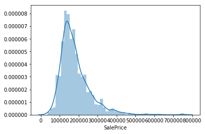

# Housing Prices: Advanced Regression Techniques
***

</img>

The House Prices are relied heavily on what house buyers are looking for. Its hard to draw up a generic conclusion on which features essentially influences the House Prices. In this notebook, I intend to use Machine Learning models to derive the essential features which are the deciding factors for the House Prices. I also built predictive models to predict the House Prices.
<br><br>
Also, this notebook is special, cause this is my first ene-to-end Machine Learning project. And I made it to <b> top 16% of the Leaderboard </b> on Kaggle.
<br><br>
<i><b>Acknowledgement</b>
<br>
- The <a href = 'http://jse.amstat.org/v19n3/decock.pdf'>Ames Housing dataset</a> was compiled by Dean De Cock.
- Kernels I sought out help from:
    - <a href="https://www.kaggle.com/dgawlik/house-prices-eda">For EDA</a>
    - <a href="https://www.kaggle.com/serigne/stacked-regressions-top-4-on-leaderboard">The idea of Stacking</a>
    - <a href="https://www.kaggle.com/laurenstc/top-2-of-leaderboard-advanced-fe">For Feature Engineering</a>
</i>

## Table Of Contents
***
### Objective
- [Goal of the notebook](#objective)

### Data Quality Check
- [Simple Inspection of Data](#inspection)

### Descriptive Statistics
- [Explore Data](#eda)
- [Univariate Analysis](#univariateAnalysis)
- [Bivariate Values](#bivariateAnalysis)

### Data Preprocessing
- [Missing Values](#missingValues)
- [Imputation](#imputation)
- [Encoding](#encoding)
- [Data Cleansing](#cleansing)
- [Feature Engineering](#newFeatures)
- [Correlation](#correlation)
- [Deletion](#deletion)

### Modelling
- [Define a cross validation strategy](#cvStrategy)
- [Base Models](#baseModels)
    - [Linear Regression](#linearRegression)
    - [Polynomial Regression](#polynomialRegression)
    - [Ridge Regression](#ridgeRegression)
    - [Lasso Regression](#lassoRegression)
    - [Elastic Net Regression](#elasticNetRegression)
    - [Decision Tree Regression](#decisionTreeRegression)
    - [Random Forest Regression](#randomForestRegression)
    - [Gradient Boosting Regression](#gradientBoost)
    - [XG Boost Regression](#xgb)
    - [LGBM Regression](#lgbm)
- [Save Models to file](#saveModels)
- [RMSLE Scores](#rmsle)
- [Feature Importance](#featureImportance)
- [Averaging Scores](#averageing)
- [Stacked Generalization](#stacking)

### Conclusion

<a id = 'objective'></a>
# Objective:
***
- To build a predictive model to predict Housing Prices.
- To understand what factors contribute more to the Housing Prices.

# Import Packages
***


```python
import pandas as pd
import numpy as np
import matplotlib.pyplot as plt
import seaborn as sns

from scipy import stats
from scipy.stats import norm, skew 

pd.options.display.max_rows = 1000
pd.options.display.max_columns = 100

%matplotlib inline
```

# Read the data
***


```python
train = pd.read_csv('../input/train.csv')
test = pd.read_csv('../input/test.csv')
```

<a id = 'inspection'></a>
# Data Quality Check
***


```python
# Examine the train dataset
train.head()
```


<div>
<style scoped>
    .dataframe tbody tr th:only-of-type {
        vertical-align: middle;
    }

    .dataframe tbody tr th {
        vertical-align: top;
    }

    .dataframe thead th {
        text-align: right;
    }
</style>
<table border="1" class="dataframe">
  <thead>
    <tr style="text-align: right;">
      <th></th>
      <th>Id</th>
      <th>MSSubClass</th>
      <th>MSZoning</th>
      <th>LotFrontage</th>
      <th>LotArea</th>
      <th>Street</th>
      <th>Alley</th>
      <th>LotShape</th>
      <th>LandContour</th>
      <th>Utilities</th>
      <th>LotConfig</th>
      <th>LandSlope</th>
      <th>Neighborhood</th>
      <th>Condition1</th>
      <th>Condition2</th>
      <th>BldgType</th>
      <th>HouseStyle</th>
      <th>OverallQual</th>
      <th>OverallCond</th>
      <th>YearBuilt</th>
      <th>YearRemodAdd</th>
      <th>RoofStyle</th>
      <th>RoofMatl</th>
      <th>Exterior1st</th>
      <th>Exterior2nd</th>
      <th>MasVnrType</th>
      <th>MasVnrArea</th>
      <th>ExterQual</th>
      <th>ExterCond</th>
      <th>Foundation</th>
      <th>BsmtQual</th>
      <th>BsmtCond</th>
      <th>BsmtExposure</th>
      <th>BsmtFinType1</th>
      <th>BsmtFinSF1</th>
      <th>BsmtFinType2</th>
      <th>BsmtFinSF2</th>
      <th>BsmtUnfSF</th>
      <th>TotalBsmtSF</th>
      <th>Heating</th>
      <th>HeatingQC</th>
      <th>CentralAir</th>
      <th>Electrical</th>
      <th>1stFlrSF</th>
      <th>2ndFlrSF</th>
      <th>LowQualFinSF</th>
      <th>GrLivArea</th>
      <th>BsmtFullBath</th>
      <th>BsmtHalfBath</th>
      <th>FullBath</th>
      <th>HalfBath</th>
      <th>BedroomAbvGr</th>
      <th>KitchenAbvGr</th>
      <th>KitchenQual</th>
      <th>TotRmsAbvGrd</th>
      <th>Functional</th>
      <th>Fireplaces</th>
      <th>FireplaceQu</th>
      <th>GarageType</th>
      <th>GarageYrBlt</th>
      <th>GarageFinish</th>
      <th>GarageCars</th>
      <th>GarageArea</th>
      <th>GarageQual</th>
      <th>GarageCond</th>
      <th>PavedDrive</th>
      <th>WoodDeckSF</th>
      <th>OpenPorchSF</th>
      <th>EnclosedPorch</th>
      <th>3SsnPorch</th>
      <th>ScreenPorch</th>
      <th>PoolArea</th>
      <th>PoolQC</th>
      <th>Fence</th>
      <th>MiscFeature</th>
      <th>MiscVal</th>
      <th>MoSold</th>
      <th>YrSold</th>
      <th>SaleType</th>
      <th>SaleCondition</th>
      <th>SalePrice</th>
    </tr>
  </thead>
  <tbody>
    <tr>
      <th>0</th>
      <td>1</td>
      <td>60</td>
      <td>RL</td>
      <td>65.0</td>
      <td>8450</td>
      <td>Pave</td>
      <td>NaN</td>
      <td>Reg</td>
      <td>Lvl</td>
      <td>AllPub</td>
      <td>Inside</td>
      <td>Gtl</td>
      <td>CollgCr</td>
      <td>Norm</td>
      <td>Norm</td>
      <td>1Fam</td>
      <td>2Story</td>
      <td>7</td>
      <td>5</td>
      <td>2003</td>
      <td>2003</td>
      <td>Gable</td>
      <td>CompShg</td>
      <td>VinylSd</td>
      <td>VinylSd</td>
      <td>BrkFace</td>
      <td>196.0</td>
      <td>Gd</td>
      <td>TA</td>
      <td>PConc</td>
      <td>Gd</td>
      <td>TA</td>
      <td>No</td>
      <td>GLQ</td>
      <td>706</td>
      <td>Unf</td>
      <td>0</td>
      <td>150</td>
      <td>856</td>
      <td>GasA</td>
      <td>Ex</td>
      <td>Y</td>
      <td>SBrkr</td>
      <td>856</td>
      <td>854</td>
      <td>0</td>
      <td>1710</td>
      <td>1</td>
      <td>0</td>
      <td>2</td>
      <td>1</td>
      <td>3</td>
      <td>1</td>
      <td>Gd</td>
      <td>8</td>
      <td>Typ</td>
      <td>0</td>
      <td>NaN</td>
      <td>Attchd</td>
      <td>2003.0</td>
      <td>RFn</td>
      <td>2</td>
      <td>548</td>
      <td>TA</td>
      <td>TA</td>
      <td>Y</td>
      <td>0</td>
      <td>61</td>
      <td>0</td>
      <td>0</td>
      <td>0</td>
      <td>0</td>
      <td>NaN</td>
      <td>NaN</td>
      <td>NaN</td>
      <td>0</td>
      <td>2</td>
      <td>2008</td>
      <td>WD</td>
      <td>Normal</td>
      <td>208500</td>
    </tr>
    <tr>
      <th>1</th>
      <td>2</td>
      <td>20</td>
      <td>RL</td>
      <td>80.0</td>
      <td>9600</td>
      <td>Pave</td>
      <td>NaN</td>
      <td>Reg</td>
      <td>Lvl</td>
      <td>AllPub</td>
      <td>FR2</td>
      <td>Gtl</td>
      <td>Veenker</td>
      <td>Feedr</td>
      <td>Norm</td>
      <td>1Fam</td>
      <td>1Story</td>
      <td>6</td>
      <td>8</td>
      <td>1976</td>
      <td>1976</td>
      <td>Gable</td>
      <td>CompShg</td>
      <td>MetalSd</td>
      <td>MetalSd</td>
      <td>None</td>
      <td>0.0</td>
      <td>TA</td>
      <td>TA</td>
      <td>CBlock</td>
      <td>Gd</td>
      <td>TA</td>
      <td>Gd</td>
      <td>ALQ</td>
      <td>978</td>
      <td>Unf</td>
      <td>0</td>
      <td>284</td>
      <td>1262</td>
      <td>GasA</td>
      <td>Ex</td>
      <td>Y</td>
      <td>SBrkr</td>
      <td>1262</td>
      <td>0</td>
      <td>0</td>
      <td>1262</td>
      <td>0</td>
      <td>1</td>
      <td>2</td>
      <td>0</td>
      <td>3</td>
      <td>1</td>
      <td>TA</td>
      <td>6</td>
      <td>Typ</td>
      <td>1</td>
      <td>TA</td>
      <td>Attchd</td>
      <td>1976.0</td>
      <td>RFn</td>
      <td>2</td>
      <td>460</td>
      <td>TA</td>
      <td>TA</td>
      <td>Y</td>
      <td>298</td>
      <td>0</td>
      <td>0</td>
      <td>0</td>
      <td>0</td>
      <td>0</td>
      <td>NaN</td>
      <td>NaN</td>
      <td>NaN</td>
      <td>0</td>
      <td>5</td>
      <td>2007</td>
      <td>WD</td>
      <td>Normal</td>
      <td>181500</td>
    </tr>
    <tr>
      <th>2</th>
      <td>3</td>
      <td>60</td>
      <td>RL</td>
      <td>68.0</td>
      <td>11250</td>
      <td>Pave</td>
      <td>NaN</td>
      <td>IR1</td>
      <td>Lvl</td>
      <td>AllPub</td>
      <td>Inside</td>
      <td>Gtl</td>
      <td>CollgCr</td>
      <td>Norm</td>
      <td>Norm</td>
      <td>1Fam</td>
      <td>2Story</td>
      <td>7</td>
      <td>5</td>
      <td>2001</td>
      <td>2002</td>
      <td>Gable</td>
      <td>CompShg</td>
      <td>VinylSd</td>
      <td>VinylSd</td>
      <td>BrkFace</td>
      <td>162.0</td>
      <td>Gd</td>
      <td>TA</td>
      <td>PConc</td>
      <td>Gd</td>
      <td>TA</td>
      <td>Mn</td>
      <td>GLQ</td>
      <td>486</td>
      <td>Unf</td>
      <td>0</td>
      <td>434</td>
      <td>920</td>
      <td>GasA</td>
      <td>Ex</td>
      <td>Y</td>
      <td>SBrkr</td>
      <td>920</td>
      <td>866</td>
      <td>0</td>
      <td>1786</td>
      <td>1</td>
      <td>0</td>
      <td>2</td>
      <td>1</td>
      <td>3</td>
      <td>1</td>
      <td>Gd</td>
      <td>6</td>
      <td>Typ</td>
      <td>1</td>
      <td>TA</td>
      <td>Attchd</td>
      <td>2001.0</td>
      <td>RFn</td>
      <td>2</td>
      <td>608</td>
      <td>TA</td>
      <td>TA</td>
      <td>Y</td>
      <td>0</td>
      <td>42</td>
      <td>0</td>
      <td>0</td>
      <td>0</td>
      <td>0</td>
      <td>NaN</td>
      <td>NaN</td>
      <td>NaN</td>
      <td>0</td>
      <td>9</td>
      <td>2008</td>
      <td>WD</td>
      <td>Normal</td>
      <td>223500</td>
    </tr>
    <tr>
      <th>3</th>
      <td>4</td>
      <td>70</td>
      <td>RL</td>
      <td>60.0</td>
      <td>9550</td>
      <td>Pave</td>
      <td>NaN</td>
      <td>IR1</td>
      <td>Lvl</td>
      <td>AllPub</td>
      <td>Corner</td>
      <td>Gtl</td>
      <td>Crawfor</td>
      <td>Norm</td>
      <td>Norm</td>
      <td>1Fam</td>
      <td>2Story</td>
      <td>7</td>
      <td>5</td>
      <td>1915</td>
      <td>1970</td>
      <td>Gable</td>
      <td>CompShg</td>
      <td>Wd Sdng</td>
      <td>Wd Shng</td>
      <td>None</td>
      <td>0.0</td>
      <td>TA</td>
      <td>TA</td>
      <td>BrkTil</td>
      <td>TA</td>
      <td>Gd</td>
      <td>No</td>
      <td>ALQ</td>
      <td>216</td>
      <td>Unf</td>
      <td>0</td>
      <td>540</td>
      <td>756</td>
      <td>GasA</td>
      <td>Gd</td>
      <td>Y</td>
      <td>SBrkr</td>
      <td>961</td>
      <td>756</td>
      <td>0</td>
      <td>1717</td>
      <td>1</td>
      <td>0</td>
      <td>1</td>
      <td>0</td>
      <td>3</td>
      <td>1</td>
      <td>Gd</td>
      <td>7</td>
      <td>Typ</td>
      <td>1</td>
      <td>Gd</td>
      <td>Detchd</td>
      <td>1998.0</td>
      <td>Unf</td>
      <td>3</td>
      <td>642</td>
      <td>TA</td>
      <td>TA</td>
      <td>Y</td>
      <td>0</td>
      <td>35</td>
      <td>272</td>
      <td>0</td>
      <td>0</td>
      <td>0</td>
      <td>NaN</td>
      <td>NaN</td>
      <td>NaN</td>
      <td>0</td>
      <td>2</td>
      <td>2006</td>
      <td>WD</td>
      <td>Abnorml</td>
      <td>140000</td>
    </tr>
    <tr>
      <th>4</th>
      <td>5</td>
      <td>60</td>
      <td>RL</td>
      <td>84.0</td>
      <td>14260</td>
      <td>Pave</td>
      <td>NaN</td>
      <td>IR1</td>
      <td>Lvl</td>
      <td>AllPub</td>
      <td>FR2</td>
      <td>Gtl</td>
      <td>NoRidge</td>
      <td>Norm</td>
      <td>Norm</td>
      <td>1Fam</td>
      <td>2Story</td>
      <td>8</td>
      <td>5</td>
      <td>2000</td>
      <td>2000</td>
      <td>Gable</td>
      <td>CompShg</td>
      <td>VinylSd</td>
      <td>VinylSd</td>
      <td>BrkFace</td>
      <td>350.0</td>
      <td>Gd</td>
      <td>TA</td>
      <td>PConc</td>
      <td>Gd</td>
      <td>TA</td>
      <td>Av</td>
      <td>GLQ</td>
      <td>655</td>
      <td>Unf</td>
      <td>0</td>
      <td>490</td>
      <td>1145</td>
      <td>GasA</td>
      <td>Ex</td>
      <td>Y</td>
      <td>SBrkr</td>
      <td>1145</td>
      <td>1053</td>
      <td>0</td>
      <td>2198</td>
      <td>1</td>
      <td>0</td>
      <td>2</td>
      <td>1</td>
      <td>4</td>
      <td>1</td>
      <td>Gd</td>
      <td>9</td>
      <td>Typ</td>
      <td>1</td>
      <td>TA</td>
      <td>Attchd</td>
      <td>2000.0</td>
      <td>RFn</td>
      <td>3</td>
      <td>836</td>
      <td>TA</td>
      <td>TA</td>
      <td>Y</td>
      <td>192</td>
      <td>84</td>
      <td>0</td>
      <td>0</td>
      <td>0</td>
      <td>0</td>
      <td>NaN</td>
      <td>NaN</td>
      <td>NaN</td>
      <td>0</td>
      <td>12</td>
      <td>2008</td>
      <td>WD</td>
      <td>Normal</td>
      <td>250000</td>
    </tr>
  </tbody>
</table>
</div>


```python
# Examine the test dataset
test.head()
```


<div>
<style scoped>
    .dataframe tbody tr th:only-of-type {
        vertical-align: middle;
    }

    .dataframe tbody tr th {
        vertical-align: top;
    }

    .dataframe thead th {
        text-align: right;
    }
</style>
<table border="1" class="dataframe">
  <thead>
    <tr style="text-align: right;">
      <th></th>
      <th>Id</th>
      <th>MSSubClass</th>
      <th>MSZoning</th>
      <th>LotFrontage</th>
      <th>LotArea</th>
      <th>Street</th>
      <th>Alley</th>
      <th>LotShape</th>
      <th>LandContour</th>
      <th>Utilities</th>
      <th>LotConfig</th>
      <th>LandSlope</th>
      <th>Neighborhood</th>
      <th>Condition1</th>
      <th>Condition2</th>
      <th>BldgType</th>
      <th>HouseStyle</th>
      <th>OverallQual</th>
      <th>OverallCond</th>
      <th>YearBuilt</th>
      <th>YearRemodAdd</th>
      <th>RoofStyle</th>
      <th>RoofMatl</th>
      <th>Exterior1st</th>
      <th>Exterior2nd</th>
      <th>MasVnrType</th>
      <th>MasVnrArea</th>
      <th>ExterQual</th>
      <th>ExterCond</th>
      <th>Foundation</th>
      <th>BsmtQual</th>
      <th>BsmtCond</th>
      <th>BsmtExposure</th>
      <th>BsmtFinType1</th>
      <th>BsmtFinSF1</th>
      <th>BsmtFinType2</th>
      <th>BsmtFinSF2</th>
      <th>BsmtUnfSF</th>
      <th>TotalBsmtSF</th>
      <th>Heating</th>
      <th>HeatingQC</th>
      <th>CentralAir</th>
      <th>Electrical</th>
      <th>1stFlrSF</th>
      <th>2ndFlrSF</th>
      <th>LowQualFinSF</th>
      <th>GrLivArea</th>
      <th>BsmtFullBath</th>
      <th>BsmtHalfBath</th>
      <th>FullBath</th>
      <th>HalfBath</th>
      <th>BedroomAbvGr</th>
      <th>KitchenAbvGr</th>
      <th>KitchenQual</th>
      <th>TotRmsAbvGrd</th>
      <th>Functional</th>
      <th>Fireplaces</th>
      <th>FireplaceQu</th>
      <th>GarageType</th>
      <th>GarageYrBlt</th>
      <th>GarageFinish</th>
      <th>GarageCars</th>
      <th>GarageArea</th>
      <th>GarageQual</th>
      <th>GarageCond</th>
      <th>PavedDrive</th>
      <th>WoodDeckSF</th>
      <th>OpenPorchSF</th>
      <th>EnclosedPorch</th>
      <th>3SsnPorch</th>
      <th>ScreenPorch</th>
      <th>PoolArea</th>
      <th>PoolQC</th>
      <th>Fence</th>
      <th>MiscFeature</th>
      <th>MiscVal</th>
      <th>MoSold</th>
      <th>YrSold</th>
      <th>SaleType</th>
      <th>SaleCondition</th>
    </tr>
  </thead>
  <tbody>
    <tr>
      <th>0</th>
      <td>1461</td>
      <td>20</td>
      <td>RH</td>
      <td>80.0</td>
      <td>11622</td>
      <td>Pave</td>
      <td>NaN</td>
      <td>Reg</td>
      <td>Lvl</td>
      <td>AllPub</td>
      <td>Inside</td>
      <td>Gtl</td>
      <td>NAmes</td>
      <td>Feedr</td>
      <td>Norm</td>
      <td>1Fam</td>
      <td>1Story</td>
      <td>5</td>
      <td>6</td>
      <td>1961</td>
      <td>1961</td>
      <td>Gable</td>
      <td>CompShg</td>
      <td>VinylSd</td>
      <td>VinylSd</td>
      <td>None</td>
      <td>0.0</td>
      <td>TA</td>
      <td>TA</td>
      <td>CBlock</td>
      <td>TA</td>
      <td>TA</td>
      <td>No</td>
      <td>Rec</td>
      <td>468.0</td>
      <td>LwQ</td>
      <td>144.0</td>
      <td>270.0</td>
      <td>882.0</td>
      <td>GasA</td>
      <td>TA</td>
      <td>Y</td>
      <td>SBrkr</td>
      <td>896</td>
      <td>0</td>
      <td>0</td>
      <td>896</td>
      <td>0.0</td>
      <td>0.0</td>
      <td>1</td>
      <td>0</td>
      <td>2</td>
      <td>1</td>
      <td>TA</td>
      <td>5</td>
      <td>Typ</td>
      <td>0</td>
      <td>NaN</td>
      <td>Attchd</td>
      <td>1961.0</td>
      <td>Unf</td>
      <td>1.0</td>
      <td>730.0</td>
      <td>TA</td>
      <td>TA</td>
      <td>Y</td>
      <td>140</td>
      <td>0</td>
      <td>0</td>
      <td>0</td>
      <td>120</td>
      <td>0</td>
      <td>NaN</td>
      <td>MnPrv</td>
      <td>NaN</td>
      <td>0</td>
      <td>6</td>
      <td>2010</td>
      <td>WD</td>
      <td>Normal</td>
    </tr>
    <tr>
      <th>1</th>
      <td>1462</td>
      <td>20</td>
      <td>RL</td>
      <td>81.0</td>
      <td>14267</td>
      <td>Pave</td>
      <td>NaN</td>
      <td>IR1</td>
      <td>Lvl</td>
      <td>AllPub</td>
      <td>Corner</td>
      <td>Gtl</td>
      <td>NAmes</td>
      <td>Norm</td>
      <td>Norm</td>
      <td>1Fam</td>
      <td>1Story</td>
      <td>6</td>
      <td>6</td>
      <td>1958</td>
      <td>1958</td>
      <td>Hip</td>
      <td>CompShg</td>
      <td>Wd Sdng</td>
      <td>Wd Sdng</td>
      <td>BrkFace</td>
      <td>108.0</td>
      <td>TA</td>
      <td>TA</td>
      <td>CBlock</td>
      <td>TA</td>
      <td>TA</td>
      <td>No</td>
      <td>ALQ</td>
      <td>923.0</td>
      <td>Unf</td>
      <td>0.0</td>
      <td>406.0</td>
      <td>1329.0</td>
      <td>GasA</td>
      <td>TA</td>
      <td>Y</td>
      <td>SBrkr</td>
      <td>1329</td>
      <td>0</td>
      <td>0</td>
      <td>1329</td>
      <td>0.0</td>
      <td>0.0</td>
      <td>1</td>
      <td>1</td>
      <td>3</td>
      <td>1</td>
      <td>Gd</td>
      <td>6</td>
      <td>Typ</td>
      <td>0</td>
      <td>NaN</td>
      <td>Attchd</td>
      <td>1958.0</td>
      <td>Unf</td>
      <td>1.0</td>
      <td>312.0</td>
      <td>TA</td>
      <td>TA</td>
      <td>Y</td>
      <td>393</td>
      <td>36</td>
      <td>0</td>
      <td>0</td>
      <td>0</td>
      <td>0</td>
      <td>NaN</td>
      <td>NaN</td>
      <td>Gar2</td>
      <td>12500</td>
      <td>6</td>
      <td>2010</td>
      <td>WD</td>
      <td>Normal</td>
    </tr>
    <tr>
      <th>2</th>
      <td>1463</td>
      <td>60</td>
      <td>RL</td>
      <td>74.0</td>
      <td>13830</td>
      <td>Pave</td>
      <td>NaN</td>
      <td>IR1</td>
      <td>Lvl</td>
      <td>AllPub</td>
      <td>Inside</td>
      <td>Gtl</td>
      <td>Gilbert</td>
      <td>Norm</td>
      <td>Norm</td>
      <td>1Fam</td>
      <td>2Story</td>
      <td>5</td>
      <td>5</td>
      <td>1997</td>
      <td>1998</td>
      <td>Gable</td>
      <td>CompShg</td>
      <td>VinylSd</td>
      <td>VinylSd</td>
      <td>None</td>
      <td>0.0</td>
      <td>TA</td>
      <td>TA</td>
      <td>PConc</td>
      <td>Gd</td>
      <td>TA</td>
      <td>No</td>
      <td>GLQ</td>
      <td>791.0</td>
      <td>Unf</td>
      <td>0.0</td>
      <td>137.0</td>
      <td>928.0</td>
      <td>GasA</td>
      <td>Gd</td>
      <td>Y</td>
      <td>SBrkr</td>
      <td>928</td>
      <td>701</td>
      <td>0</td>
      <td>1629</td>
      <td>0.0</td>
      <td>0.0</td>
      <td>2</td>
      <td>1</td>
      <td>3</td>
      <td>1</td>
      <td>TA</td>
      <td>6</td>
      <td>Typ</td>
      <td>1</td>
      <td>TA</td>
      <td>Attchd</td>
      <td>1997.0</td>
      <td>Fin</td>
      <td>2.0</td>
      <td>482.0</td>
      <td>TA</td>
      <td>TA</td>
      <td>Y</td>
      <td>212</td>
      <td>34</td>
      <td>0</td>
      <td>0</td>
      <td>0</td>
      <td>0</td>
      <td>NaN</td>
      <td>MnPrv</td>
      <td>NaN</td>
      <td>0</td>
      <td>3</td>
      <td>2010</td>
      <td>WD</td>
      <td>Normal</td>
    </tr>
    <tr>
      <th>3</th>
      <td>1464</td>
      <td>60</td>
      <td>RL</td>
      <td>78.0</td>
      <td>9978</td>
      <td>Pave</td>
      <td>NaN</td>
      <td>IR1</td>
      <td>Lvl</td>
      <td>AllPub</td>
      <td>Inside</td>
      <td>Gtl</td>
      <td>Gilbert</td>
      <td>Norm</td>
      <td>Norm</td>
      <td>1Fam</td>
      <td>2Story</td>
      <td>6</td>
      <td>6</td>
      <td>1998</td>
      <td>1998</td>
      <td>Gable</td>
      <td>CompShg</td>
      <td>VinylSd</td>
      <td>VinylSd</td>
      <td>BrkFace</td>
      <td>20.0</td>
      <td>TA</td>
      <td>TA</td>
      <td>PConc</td>
      <td>TA</td>
      <td>TA</td>
      <td>No</td>
      <td>GLQ</td>
      <td>602.0</td>
      <td>Unf</td>
      <td>0.0</td>
      <td>324.0</td>
      <td>926.0</td>
      <td>GasA</td>
      <td>Ex</td>
      <td>Y</td>
      <td>SBrkr</td>
      <td>926</td>
      <td>678</td>
      <td>0</td>
      <td>1604</td>
      <td>0.0</td>
      <td>0.0</td>
      <td>2</td>
      <td>1</td>
      <td>3</td>
      <td>1</td>
      <td>Gd</td>
      <td>7</td>
      <td>Typ</td>
      <td>1</td>
      <td>Gd</td>
      <td>Attchd</td>
      <td>1998.0</td>
      <td>Fin</td>
      <td>2.0</td>
      <td>470.0</td>
      <td>TA</td>
      <td>TA</td>
      <td>Y</td>
      <td>360</td>
      <td>36</td>
      <td>0</td>
      <td>0</td>
      <td>0</td>
      <td>0</td>
      <td>NaN</td>
      <td>NaN</td>
      <td>NaN</td>
      <td>0</td>
      <td>6</td>
      <td>2010</td>
      <td>WD</td>
      <td>Normal</td>
    </tr>
    <tr>
      <th>4</th>
      <td>1465</td>
      <td>120</td>
      <td>RL</td>
      <td>43.0</td>
      <td>5005</td>
      <td>Pave</td>
      <td>NaN</td>
      <td>IR1</td>
      <td>HLS</td>
      <td>AllPub</td>
      <td>Inside</td>
      <td>Gtl</td>
      <td>StoneBr</td>
      <td>Norm</td>
      <td>Norm</td>
      <td>TwnhsE</td>
      <td>1Story</td>
      <td>8</td>
      <td>5</td>
      <td>1992</td>
      <td>1992</td>
      <td>Gable</td>
      <td>CompShg</td>
      <td>HdBoard</td>
      <td>HdBoard</td>
      <td>None</td>
      <td>0.0</td>
      <td>Gd</td>
      <td>TA</td>
      <td>PConc</td>
      <td>Gd</td>
      <td>TA</td>
      <td>No</td>
      <td>ALQ</td>
      <td>263.0</td>
      <td>Unf</td>
      <td>0.0</td>
      <td>1017.0</td>
      <td>1280.0</td>
      <td>GasA</td>
      <td>Ex</td>
      <td>Y</td>
      <td>SBrkr</td>
      <td>1280</td>
      <td>0</td>
      <td>0</td>
      <td>1280</td>
      <td>0.0</td>
      <td>0.0</td>
      <td>2</td>
      <td>0</td>
      <td>2</td>
      <td>1</td>
      <td>Gd</td>
      <td>5</td>
      <td>Typ</td>
      <td>0</td>
      <td>NaN</td>
      <td>Attchd</td>
      <td>1992.0</td>
      <td>RFn</td>
      <td>2.0</td>
      <td>506.0</td>
      <td>TA</td>
      <td>TA</td>
      <td>Y</td>
      <td>0</td>
      <td>82</td>
      <td>0</td>
      <td>0</td>
      <td>144</td>
      <td>0</td>
      <td>NaN</td>
      <td>NaN</td>
      <td>NaN</td>
      <td>0</td>
      <td>1</td>
      <td>2010</td>
      <td>WD</td>
      <td>Normal</td>
    </tr>
  </tbody>
</table>
</div>


```python
# Check the type of our features. Are there any data inconsistencies?
train.dtypes
```


    Id                 int64
    MSSubClass         int64
    MSZoning          object
    LotFrontage      float64
    LotArea            int64
    Street            object
    Alley             object
    LotShape          object
    LandContour       object
    Utilities         object
    LotConfig         object
    LandSlope         object
    Neighborhood      object
    Condition1        object
    Condition2        object
    BldgType          object
    HouseStyle        object
    OverallQual        int64
    OverallCond        int64
    YearBuilt          int64
    YearRemodAdd       int64
    RoofStyle         object
    RoofMatl          object
    Exterior1st       object
    Exterior2nd       object
    MasVnrType        object
    MasVnrArea       float64
    ExterQual         object
    ExterCond         object
    Foundation        object
    BsmtQual          object
    BsmtCond          object
    BsmtExposure      object
    BsmtFinType1      object
    BsmtFinSF1         int64
    BsmtFinType2      object
    BsmtFinSF2         int64
    BsmtUnfSF          int64
    TotalBsmtSF        int64
    Heating           object
    HeatingQC         object
    CentralAir        object
    Electrical        object
    1stFlrSF           int64
    2ndFlrSF           int64
    LowQualFinSF       int64
    GrLivArea          int64
    BsmtFullBath       int64
    BsmtHalfBath       int64
    FullBath           int64
    HalfBath           int64
    BedroomAbvGr       int64
    KitchenAbvGr       int64
    KitchenQual       object
    TotRmsAbvGrd       int64
    Functional        object
    Fireplaces         int64
    FireplaceQu       object
    GarageType        object
    GarageYrBlt      float64
    GarageFinish      object
    GarageCars         int64
    GarageArea         int64
    GarageQual        object
    GarageCond        object
    PavedDrive        object
    WoodDeckSF         int64
    OpenPorchSF        int64
    EnclosedPorch      int64
    3SsnPorch          int64
    ScreenPorch        int64
    PoolArea           int64
    PoolQC            object
    Fence             object
    MiscFeature       object
    MiscVal            int64
    MoSold             int64
    YrSold             int64
    SaleType          object
    SaleCondition     object
    SalePrice          int64
    dtype: object


```python
# Can you check to see if there are any missing values in our data set
train.isnull().any()
```


    Id               False
    MSSubClass       False
    MSZoning         False
    LotFrontage       True
    LotArea          False
    Street           False
    Alley             True
    LotShape         False
    LandContour      False
    Utilities        False
    LotConfig        False
    LandSlope        False
    Neighborhood     False
    Condition1       False
    Condition2       False
    BldgType         False
    HouseStyle       False
    OverallQual      False
    OverallCond      False
    YearBuilt        False
    YearRemodAdd     False
    RoofStyle        False
    RoofMatl         False
    Exterior1st      False
    Exterior2nd      False
    MasVnrType        True
    MasVnrArea        True
    ExterQual        False
    ExterCond        False
    Foundation       False
    BsmtQual          True
    BsmtCond          True
    BsmtExposure      True
    BsmtFinType1      True
    BsmtFinSF1       False
    BsmtFinType2      True
    BsmtFinSF2       False
    BsmtUnfSF        False
    TotalBsmtSF      False
    Heating          False
    HeatingQC        False
    CentralAir       False
    Electrical        True
    1stFlrSF         False
    2ndFlrSF         False
    LowQualFinSF     False
    GrLivArea        False
    BsmtFullBath     False
    BsmtHalfBath     False
    FullBath         False
    HalfBath         False
    BedroomAbvGr     False
    KitchenAbvGr     False
    KitchenQual      False
    TotRmsAbvGrd     False
    Functional       False
    Fireplaces       False
    FireplaceQu       True
    GarageType        True
    GarageYrBlt       True
    GarageFinish      True
    GarageCars       False
    GarageArea       False
    GarageQual        True
    GarageCond        True
    PavedDrive       False
    WoodDeckSF       False
    OpenPorchSF      False
    EnclosedPorch    False
    3SsnPorch        False
    ScreenPorch      False
    PoolArea         False
    PoolQC            True
    Fence             True
    MiscFeature       True
    MiscVal          False
    MoSold           False
    YrSold           False
    SaleType         False
    SaleCondition    False
    SalePrice        False
    dtype: bool


```python
# Feature 'MSSubClass' has numerical value, but it is a nominal data. So, converting it to categorical data
train['MSSubClass'] = train['MSSubClass'].apply(str)
test['MSSubClass'] = test['MSSubClass'].apply(str)
```


```python
# concatenating the data
all_data = pd.concat((train.drop(['Id', 'SalePrice'], axis = 1),
                      test.drop(['Id'], axis = 1))).reset_index(drop=True)
```


```python
# What is the size of the training set?
train.shape
```


    (1460, 81)


```python
# What is the size of the test set?
test.shape
```


    (1459, 80)


<a id = 'eda'></a>
# Exploratory Data Analysis
***


```python
# Display the statistical overview of the numerical attributes of houses
all_data.describe()
```


<div>
<style scoped>
    .dataframe tbody tr th:only-of-type {
        vertical-align: middle;
    }

    .dataframe tbody tr th {
        vertical-align: top;
    }

    .dataframe thead th {
        text-align: right;
    }
</style>
<table border="1" class="dataframe">
  <thead>
    <tr style="text-align: right;">
      <th></th>
      <th>LotFrontage</th>
      <th>LotArea</th>
      <th>OverallQual</th>
      <th>OverallCond</th>
      <th>YearBuilt</th>
      <th>YearRemodAdd</th>
      <th>MasVnrArea</th>
      <th>BsmtFinSF1</th>
      <th>BsmtFinSF2</th>
      <th>BsmtUnfSF</th>
      <th>TotalBsmtSF</th>
      <th>1stFlrSF</th>
      <th>2ndFlrSF</th>
      <th>LowQualFinSF</th>
      <th>GrLivArea</th>
      <th>BsmtFullBath</th>
      <th>BsmtHalfBath</th>
      <th>FullBath</th>
      <th>HalfBath</th>
      <th>BedroomAbvGr</th>
      <th>KitchenAbvGr</th>
      <th>TotRmsAbvGrd</th>
      <th>Fireplaces</th>
      <th>GarageYrBlt</th>
      <th>GarageCars</th>
      <th>GarageArea</th>
      <th>WoodDeckSF</th>
      <th>OpenPorchSF</th>
      <th>EnclosedPorch</th>
      <th>3SsnPorch</th>
      <th>ScreenPorch</th>
      <th>PoolArea</th>
      <th>MiscVal</th>
      <th>MoSold</th>
      <th>YrSold</th>
    </tr>
  </thead>
  <tbody>
    <tr>
      <th>count</th>
      <td>2433.000000</td>
      <td>2919.000000</td>
      <td>2919.000000</td>
      <td>2919.000000</td>
      <td>2919.000000</td>
      <td>2919.000000</td>
      <td>2896.000000</td>
      <td>2918.000000</td>
      <td>2918.000000</td>
      <td>2918.000000</td>
      <td>2918.000000</td>
      <td>2919.000000</td>
      <td>2919.000000</td>
      <td>2919.000000</td>
      <td>2919.000000</td>
      <td>2917.000000</td>
      <td>2917.000000</td>
      <td>2919.000000</td>
      <td>2919.000000</td>
      <td>2919.000000</td>
      <td>2919.000000</td>
      <td>2919.000000</td>
      <td>2919.000000</td>
      <td>2760.000000</td>
      <td>2918.000000</td>
      <td>2918.000000</td>
      <td>2919.000000</td>
      <td>2919.000000</td>
      <td>2919.000000</td>
      <td>2919.000000</td>
      <td>2919.000000</td>
      <td>2919.000000</td>
      <td>2919.000000</td>
      <td>2919.000000</td>
      <td>2919.000000</td>
    </tr>
    <tr>
      <th>mean</th>
      <td>69.305795</td>
      <td>10168.114080</td>
      <td>6.089072</td>
      <td>5.564577</td>
      <td>1971.312778</td>
      <td>1984.264474</td>
      <td>102.201312</td>
      <td>441.423235</td>
      <td>49.582248</td>
      <td>560.772104</td>
      <td>1051.777587</td>
      <td>1159.581706</td>
      <td>336.483727</td>
      <td>4.694416</td>
      <td>1500.759849</td>
      <td>0.429894</td>
      <td>0.061364</td>
      <td>1.568003</td>
      <td>0.380267</td>
      <td>2.860226</td>
      <td>1.044536</td>
      <td>6.451524</td>
      <td>0.597122</td>
      <td>1978.113406</td>
      <td>1.766621</td>
      <td>472.874572</td>
      <td>93.709832</td>
      <td>47.486811</td>
      <td>23.098321</td>
      <td>2.602261</td>
      <td>16.062350</td>
      <td>2.251799</td>
      <td>50.825968</td>
      <td>6.213087</td>
      <td>2007.792737</td>
    </tr>
    <tr>
      <th>std</th>
      <td>23.344905</td>
      <td>7886.996359</td>
      <td>1.409947</td>
      <td>1.113131</td>
      <td>30.291442</td>
      <td>20.894344</td>
      <td>179.334253</td>
      <td>455.610826</td>
      <td>169.205611</td>
      <td>439.543659</td>
      <td>440.766258</td>
      <td>392.362079</td>
      <td>428.701456</td>
      <td>46.396825</td>
      <td>506.051045</td>
      <td>0.524736</td>
      <td>0.245687</td>
      <td>0.552969</td>
      <td>0.502872</td>
      <td>0.822693</td>
      <td>0.214462</td>
      <td>1.569379</td>
      <td>0.646129</td>
      <td>25.574285</td>
      <td>0.761624</td>
      <td>215.394815</td>
      <td>126.526589</td>
      <td>67.575493</td>
      <td>64.244246</td>
      <td>25.188169</td>
      <td>56.184365</td>
      <td>35.663946</td>
      <td>567.402211</td>
      <td>2.714762</td>
      <td>1.314964</td>
    </tr>
    <tr>
      <th>min</th>
      <td>21.000000</td>
      <td>1300.000000</td>
      <td>1.000000</td>
      <td>1.000000</td>
      <td>1872.000000</td>
      <td>1950.000000</td>
      <td>0.000000</td>
      <td>0.000000</td>
      <td>0.000000</td>
      <td>0.000000</td>
      <td>0.000000</td>
      <td>334.000000</td>
      <td>0.000000</td>
      <td>0.000000</td>
      <td>334.000000</td>
      <td>0.000000</td>
      <td>0.000000</td>
      <td>0.000000</td>
      <td>0.000000</td>
      <td>0.000000</td>
      <td>0.000000</td>
      <td>2.000000</td>
      <td>0.000000</td>
      <td>1895.000000</td>
      <td>0.000000</td>
      <td>0.000000</td>
      <td>0.000000</td>
      <td>0.000000</td>
      <td>0.000000</td>
      <td>0.000000</td>
      <td>0.000000</td>
      <td>0.000000</td>
      <td>0.000000</td>
      <td>1.000000</td>
      <td>2006.000000</td>
    </tr>
    <tr>
      <th>25%</th>
      <td>59.000000</td>
      <td>7478.000000</td>
      <td>5.000000</td>
      <td>5.000000</td>
      <td>1953.500000</td>
      <td>1965.000000</td>
      <td>0.000000</td>
      <td>0.000000</td>
      <td>0.000000</td>
      <td>220.000000</td>
      <td>793.000000</td>
      <td>876.000000</td>
      <td>0.000000</td>
      <td>0.000000</td>
      <td>1126.000000</td>
      <td>0.000000</td>
      <td>0.000000</td>
      <td>1.000000</td>
      <td>0.000000</td>
      <td>2.000000</td>
      <td>1.000000</td>
      <td>5.000000</td>
      <td>0.000000</td>
      <td>1960.000000</td>
      <td>1.000000</td>
      <td>320.000000</td>
      <td>0.000000</td>
      <td>0.000000</td>
      <td>0.000000</td>
      <td>0.000000</td>
      <td>0.000000</td>
      <td>0.000000</td>
      <td>0.000000</td>
      <td>4.000000</td>
      <td>2007.000000</td>
    </tr>
    <tr>
      <th>50%</th>
      <td>68.000000</td>
      <td>9453.000000</td>
      <td>6.000000</td>
      <td>5.000000</td>
      <td>1973.000000</td>
      <td>1993.000000</td>
      <td>0.000000</td>
      <td>368.500000</td>
      <td>0.000000</td>
      <td>467.000000</td>
      <td>989.500000</td>
      <td>1082.000000</td>
      <td>0.000000</td>
      <td>0.000000</td>
      <td>1444.000000</td>
      <td>0.000000</td>
      <td>0.000000</td>
      <td>2.000000</td>
      <td>0.000000</td>
      <td>3.000000</td>
      <td>1.000000</td>
      <td>6.000000</td>
      <td>1.000000</td>
      <td>1979.000000</td>
      <td>2.000000</td>
      <td>480.000000</td>
      <td>0.000000</td>
      <td>26.000000</td>
      <td>0.000000</td>
      <td>0.000000</td>
      <td>0.000000</td>
      <td>0.000000</td>
      <td>0.000000</td>
      <td>6.000000</td>
      <td>2008.000000</td>
    </tr>
    <tr>
      <th>75%</th>
      <td>80.000000</td>
      <td>11570.000000</td>
      <td>7.000000</td>
      <td>6.000000</td>
      <td>2001.000000</td>
      <td>2004.000000</td>
      <td>164.000000</td>
      <td>733.000000</td>
      <td>0.000000</td>
      <td>805.500000</td>
      <td>1302.000000</td>
      <td>1387.500000</td>
      <td>704.000000</td>
      <td>0.000000</td>
      <td>1743.500000</td>
      <td>1.000000</td>
      <td>0.000000</td>
      <td>2.000000</td>
      <td>1.000000</td>
      <td>3.000000</td>
      <td>1.000000</td>
      <td>7.000000</td>
      <td>1.000000</td>
      <td>2002.000000</td>
      <td>2.000000</td>
      <td>576.000000</td>
      <td>168.000000</td>
      <td>70.000000</td>
      <td>0.000000</td>
      <td>0.000000</td>
      <td>0.000000</td>
      <td>0.000000</td>
      <td>0.000000</td>
      <td>8.000000</td>
      <td>2009.000000</td>
    </tr>
    <tr>
      <th>max</th>
      <td>313.000000</td>
      <td>215245.000000</td>
      <td>10.000000</td>
      <td>9.000000</td>
      <td>2010.000000</td>
      <td>2010.000000</td>
      <td>1600.000000</td>
      <td>5644.000000</td>
      <td>1526.000000</td>
      <td>2336.000000</td>
      <td>6110.000000</td>
      <td>5095.000000</td>
      <td>2065.000000</td>
      <td>1064.000000</td>
      <td>5642.000000</td>
      <td>3.000000</td>
      <td>2.000000</td>
      <td>4.000000</td>
      <td>2.000000</td>
      <td>8.000000</td>
      <td>3.000000</td>
      <td>15.000000</td>
      <td>4.000000</td>
      <td>2207.000000</td>
      <td>5.000000</td>
      <td>1488.000000</td>
      <td>1424.000000</td>
      <td>742.000000</td>
      <td>1012.000000</td>
      <td>508.000000</td>
      <td>576.000000</td>
      <td>800.000000</td>
      <td>17000.000000</td>
      <td>12.000000</td>
      <td>2010.000000</td>
    </tr>
  </tbody>
</table>
</div>


<b>Observations:</b>
- The max value "LotFrontage"is 313, while its median ad third quartile are 68 and 80. There could be one/few outliers.
- The max value "LotArea" is 215245, while its median and third quartile are 9453 and 11570. There could be one/few outliers.
- The max value of "BsmtFinSF1" is 5644, while the third quartile is just 733. The value "5644" could be an outlier.
- The max value of "TotalBsmtSF" is 6110, while the median and third quartile is just 989 and 1302. The value "6110" could be an outlier.
- The max value of "GarageYrBlt" is 2207. Clearly, 2207 is an outlier.


```python
# Display the statistical overview of the Sale Prices of the houses
train['SalePrice'].describe()
```


    count      1460.000000
    mean     180921.195890
    std       79442.502883
    min       34900.000000
    25%      129975.000000
    50%      163000.000000
    75%      214000.000000
    max      755000.000000
    Name: SalePrice, dtype: float64


```python
# Display the statistical overview of the categorical attributes of houses
all_data.describe(include = 'object')
```


<div>
<style scoped>
    .dataframe tbody tr th:only-of-type {
        vertical-align: middle;
    }

    .dataframe tbody tr th {
        vertical-align: top;
    }

    .dataframe thead th {
        text-align: right;
    }
</style>
<table border="1" class="dataframe">
  <thead>
    <tr style="text-align: right;">
      <th></th>
      <th>MSSubClass</th>
      <th>MSZoning</th>
      <th>Street</th>
      <th>Alley</th>
      <th>LotShape</th>
      <th>LandContour</th>
      <th>Utilities</th>
      <th>LotConfig</th>
      <th>LandSlope</th>
      <th>Neighborhood</th>
      <th>Condition1</th>
      <th>Condition2</th>
      <th>BldgType</th>
      <th>HouseStyle</th>
      <th>RoofStyle</th>
      <th>RoofMatl</th>
      <th>Exterior1st</th>
      <th>Exterior2nd</th>
      <th>MasVnrType</th>
      <th>ExterQual</th>
      <th>ExterCond</th>
      <th>Foundation</th>
      <th>BsmtQual</th>
      <th>BsmtCond</th>
      <th>BsmtExposure</th>
      <th>BsmtFinType1</th>
      <th>BsmtFinType2</th>
      <th>Heating</th>
      <th>HeatingQC</th>
      <th>CentralAir</th>
      <th>Electrical</th>
      <th>KitchenQual</th>
      <th>Functional</th>
      <th>FireplaceQu</th>
      <th>GarageType</th>
      <th>GarageFinish</th>
      <th>GarageQual</th>
      <th>GarageCond</th>
      <th>PavedDrive</th>
      <th>PoolQC</th>
      <th>Fence</th>
      <th>MiscFeature</th>
      <th>SaleType</th>
      <th>SaleCondition</th>
    </tr>
  </thead>
  <tbody>
    <tr>
      <th>count</th>
      <td>2919</td>
      <td>2915</td>
      <td>2919</td>
      <td>198</td>
      <td>2919</td>
      <td>2919</td>
      <td>2917</td>
      <td>2919</td>
      <td>2919</td>
      <td>2919</td>
      <td>2919</td>
      <td>2919</td>
      <td>2919</td>
      <td>2919</td>
      <td>2919</td>
      <td>2919</td>
      <td>2918</td>
      <td>2918</td>
      <td>2895</td>
      <td>2919</td>
      <td>2919</td>
      <td>2919</td>
      <td>2838</td>
      <td>2837</td>
      <td>2837</td>
      <td>2840</td>
      <td>2839</td>
      <td>2919</td>
      <td>2919</td>
      <td>2919</td>
      <td>2918</td>
      <td>2918</td>
      <td>2917</td>
      <td>1499</td>
      <td>2762</td>
      <td>2760</td>
      <td>2760</td>
      <td>2760</td>
      <td>2919</td>
      <td>10</td>
      <td>571</td>
      <td>105</td>
      <td>2918</td>
      <td>2919</td>
    </tr>
    <tr>
      <th>unique</th>
      <td>16</td>
      <td>5</td>
      <td>2</td>
      <td>2</td>
      <td>4</td>
      <td>4</td>
      <td>2</td>
      <td>5</td>
      <td>3</td>
      <td>25</td>
      <td>9</td>
      <td>8</td>
      <td>5</td>
      <td>8</td>
      <td>6</td>
      <td>8</td>
      <td>15</td>
      <td>16</td>
      <td>4</td>
      <td>4</td>
      <td>5</td>
      <td>6</td>
      <td>4</td>
      <td>4</td>
      <td>4</td>
      <td>6</td>
      <td>6</td>
      <td>6</td>
      <td>5</td>
      <td>2</td>
      <td>5</td>
      <td>4</td>
      <td>7</td>
      <td>5</td>
      <td>6</td>
      <td>3</td>
      <td>5</td>
      <td>5</td>
      <td>3</td>
      <td>3</td>
      <td>4</td>
      <td>4</td>
      <td>9</td>
      <td>6</td>
    </tr>
    <tr>
      <th>top</th>
      <td>20</td>
      <td>RL</td>
      <td>Pave</td>
      <td>Grvl</td>
      <td>Reg</td>
      <td>Lvl</td>
      <td>AllPub</td>
      <td>Inside</td>
      <td>Gtl</td>
      <td>NAmes</td>
      <td>Norm</td>
      <td>Norm</td>
      <td>1Fam</td>
      <td>1Story</td>
      <td>Gable</td>
      <td>CompShg</td>
      <td>VinylSd</td>
      <td>VinylSd</td>
      <td>None</td>
      <td>TA</td>
      <td>TA</td>
      <td>PConc</td>
      <td>TA</td>
      <td>TA</td>
      <td>No</td>
      <td>Unf</td>
      <td>Unf</td>
      <td>GasA</td>
      <td>Ex</td>
      <td>Y</td>
      <td>SBrkr</td>
      <td>TA</td>
      <td>Typ</td>
      <td>Gd</td>
      <td>Attchd</td>
      <td>Unf</td>
      <td>TA</td>
      <td>TA</td>
      <td>Y</td>
      <td>Ex</td>
      <td>MnPrv</td>
      <td>Shed</td>
      <td>WD</td>
      <td>Normal</td>
    </tr>
    <tr>
      <th>freq</th>
      <td>1079</td>
      <td>2265</td>
      <td>2907</td>
      <td>120</td>
      <td>1859</td>
      <td>2622</td>
      <td>2916</td>
      <td>2133</td>
      <td>2778</td>
      <td>443</td>
      <td>2511</td>
      <td>2889</td>
      <td>2425</td>
      <td>1471</td>
      <td>2310</td>
      <td>2876</td>
      <td>1025</td>
      <td>1014</td>
      <td>1742</td>
      <td>1798</td>
      <td>2538</td>
      <td>1308</td>
      <td>1283</td>
      <td>2606</td>
      <td>1904</td>
      <td>851</td>
      <td>2493</td>
      <td>2874</td>
      <td>1493</td>
      <td>2723</td>
      <td>2671</td>
      <td>1492</td>
      <td>2717</td>
      <td>744</td>
      <td>1723</td>
      <td>1230</td>
      <td>2604</td>
      <td>2654</td>
      <td>2641</td>
      <td>4</td>
      <td>329</td>
      <td>95</td>
      <td>2525</td>
      <td>2402</td>
    </tr>
  </tbody>
</table>
</div>


```python
quantitative = [f for f in train.columns if train.dtypes[f] != 'object']
quantitative.remove('SalePrice')
quantitative.remove('Id')
qualitative = [f for f in train.columns if train.dtypes[f] == 'object']
```

<a id='univariateAnalysis'></a>
## Univariate Analysis
***

### Target variable: Sale Price
***


```python
#histogram
sns.distplot(train['SalePrice'])
```

    /Users/bishwaraj/anaconda3/lib/python3.6/site-packages/scipy/stats/stats.py:1713: FutureWarning: Using a non-tuple sequence for multidimensional indexing is deprecated; use `arr[tuple(seq)]` instead of `arr[seq]`. In the future this will be interpreted as an array index, `arr[np.array(seq)]`, which will result either in an error or a different result.
      return np.add.reduce(sorted[indexer] * weights, axis=axis) / sumval


    <matplotlib.axes._subplots.AxesSubplot at 0x1a17d37908>





The graph of SalePrice is slightly deviated from normal distribution. Let's verify the normality of curve.


```python
sns.distplot(train['SalePrice'] , fit=norm);

# Get the fitted parameters used by the function
(mu, sigma) = norm.fit(train['SalePrice'])
print( '\n mu = {:.2f} and sigma = {:.2f}\n'.format(mu, sigma))

#Now plot the distribution
plt.legend(['Normal dist. ($\mu=$ {:.2f} and $\sigma=$ {:.2f} )'.format(mu, sigma)],
            loc='best')
plt.ylabel('Frequency')
plt.title('SalePrice distribution')

#Get also the QQ-plot
fig = plt.figure()
res = stats.probplot(train['SalePrice'], plot=plt)
plt.show()
```

    /Users/bishwaraj/anaconda3/lib/python3.6/site-packages/scipy/stats/stats.py:1713: FutureWarning: Using a non-tuple sequence for multidimensional indexing is deprecated; use `arr[tuple(seq)]` instead of `arr[seq]`. In the future this will be interpreted as an array index, `arr[np.array(seq)]`, which will result either in an error or a different result.
      return np.add.reduce(sorted[indexer] * weights, axis=axis) / sumval


    
     mu = 180921.20 and sigma = 79415.29
    


The graph is positively skewed and too far from normal distribution. Let us make log transformation to make it normally distributed. Following are the benefits of having normally distributed target variable:
- The linear models tend to work better with normally distributed data.
- Submissions of the competitions are evaluated on Root-Mean-Squared-Error (RMSE) between the <b>logarithm</b> of the predicted value and the <b>logarithm</b> of the observed sales price. So, once transformation is done, we can evaluate the RMSE of our models locally. Easy peasy!

### Log transformation of Sale Price
***


```python
#We use the numpy fuction log1p which  applies log(1+x) to all elements of the column
train["SalePrice"] = np.log1p(train["SalePrice"])

#Check the new distribution 
sns.distplot(train['SalePrice'] , fit=norm);

# Get the fitted parameters used by the function
(mu, sigma) = norm.fit(train['SalePrice'])
print( '\n mu = {:.2f} and sigma = {:.2f}\n'.format(mu, sigma))

#Now plot the distribution
plt.legend(['Normal dist. ($\mu=$ {:.2f} and $\sigma=$ {:.2f} )'.format(mu, sigma)],
            loc='best')
plt.ylabel('Frequency')
plt.title('SalePrice distribution')

#Get also the QQ-plot
fig = plt.figure()
res = stats.probplot(train['SalePrice'], plot=plt)
plt.show()
```

    /Users/bishwaraj/anaconda3/lib/python3.6/site-packages/scipy/stats/stats.py:1713: FutureWarning: Using a non-tuple sequence for multidimensional indexing is deprecated; use `arr[tuple(seq)]` instead of `arr[seq]`. In the future this will be interpreted as an array index, `arr[np.array(seq)]`, which will result either in an error or a different result.
      return np.add.reduce(sorted[indexer] * weights, axis=axis) / sumval


    
     mu = 12.02 and sigma = 0.40
    


### Numerical Attributes
***


```python
f = pd.melt(train, value_vars=quantitative)
g = sns.FacetGrid(f, col="variable",  col_wrap=5, sharex=False, sharey=False)
g = g.map(sns.distplot, "value")
```

    /Users/bishwaraj/anaconda3/lib/python3.6/site-packages/scipy/stats/stats.py:1713: FutureWarning: Using a non-tuple sequence for multidimensional indexing is deprecated; use `arr[tuple(seq)]` instead of `arr[seq]`. In the future this will be interpreted as an array index, `arr[np.array(seq)]`, which will result either in an error or a different result.
      return np.add.reduce(sorted[indexer] * weights, axis=axis) / sumval


<b><i>Observations</i></b>
- Only 0.45% of houses have Pool.
- Only 1.64% of houses have 3SsnPorch.
- Only 1.78% of houses have Low Quality Finishing of floor.
- Only 2.19% of houses have Lot Area greater than 25000. The max value of Lot Area ranges above 200000. This is the reason the plot below 25000 is a bit obscure.
- Only 3.56% of houses have Miscellaneous values.
- Only 4.58% of houses have more than 1 Kitchen
- Only 8% of houses have ScreenPorch.
- Only 11.43% of houses have Type 2 finished Basement surface
- Only 14% of houses have Enclosed Porch
- 41% of houses have Masonry Veneer
- 68% of houses have Type 1 finished Basement surface

<a id='bivariateAnalysis'></a>
## Bivariate Analysis
***

### Numerical Attributes
***


```python
def scatterplot(x, y, **kwargs):
    sns.scatterplot(x=x, y=y)
    
f = pd.melt(train, id_vars=['SalePrice'], value_vars=quantitative)
g = sns.FacetGrid(f, col="variable",  col_wrap=5, sharex=False, sharey=False)
g = g.map(scatterplot, "value", "SalePrice")
```


<b><i>Observations</i></b>
- "OverallQual", "TotalBsmtSF", "1stFlrSF" and "GrLivArea" are strongly positively correlated to "SalePrice".
- The "YrBuilt", "YrRemodAdd" and "MasVnrArea" are weakly correlated to "SalePrice".
- "FullBath" seems to have better correlation to "SalePrice", in comparison to "HalfBath", "BsmtFullBath" and "BsmtHalfBath".
- While "TotalRmsAbvGrd" is positively correlated to "SalePrice", strangely "BedroomAbvGrd" does not seem to have significant affect on "SalePrice".
- There is an outlier that can be seen in plot GrLivArea-SalePrice, TotalBsmtSF-SalePrice, BsmtFinSF1-SalePrice and 1stFlrSF-SalePrice. The area of the house is greater than 4000, but the SalePrice is low.
- As identified earlier as well, there are two values of "LotFrontage" that are higher than 300, while rest of the values are below 180. We are not sure if they are indeed outlier. It would be wise to test the performance of the model with them and without them and see what performs better.
- Also, there is a "LotArea" which has a value above 200000. Like previous case, we are not sure if its an outlier.
- The houses with "Pool" constitute the upper half of Sale Prices.
- "YrSold" and "MoSold" don't seem to have impact on Sale Prices.

### Categorical Attributes
***


```python
def boxplot(x, y, **kwargs):
    sns.boxplot(x=x, y=y)
    x=plt.xticks(rotation=90)
    
f = pd.melt(train, id_vars=['SalePrice'], value_vars=qualitative)
g = sns.FacetGrid(f, col="variable",  col_wrap=4, sharex=False, sharey=False)
g = g.map(boxplot, "value", "SalePrice")
```


# Data Preprocessing
***


<a id='missingValues'></a>
## Missing Values
***


```python
missing_total = all_data.isnull().sum().sort_values(ascending=False)
percent = (all_data.isnull().sum() * 100/all_data.isnull().count()).sort_values(ascending=False)
missing_data = pd.concat([missing_total, percent], axis=1, keys=['Total', 'Percent'])
missing_data[missing_data['Percent'] > 0]['Percent'].plot.bar(by = 'Percent', figsize=(10,4))
```


    <matplotlib.axes._subplots.AxesSubplot at 0x1a1a10b1d0>


<a id='imputation'></a>
## Imputation
***


```python
# All columns where missing values can be replaced with 'None'
for col in ('PoolQC', 'Alley', 'Fence', 'FireplaceQu', 'GarageType', 'GarageFinish',
            'GarageQual', 'GarageCond', 'MasVnrType', 'BsmtQual', 'BsmtCond', 
            'BsmtExposure', 'BsmtFinType1', 'BsmtFinType2', 'MSSubClass', 'MiscFeature', 'Utilities'):
    all_data[col] = all_data[col].fillna("None")
```


```python
# All columns where missing values can be replaced with 0
for col in ('GarageArea', 'GarageCars', 'BsmtFinSF1', 'BsmtFinSF2', 
            'BsmtUnfSF','TotalBsmtSF', 'BsmtFullBath', 'BsmtHalfBath', 'MasVnrArea'):
    all_data[col] = all_data[col].fillna(0)
```


```python
# Imputing GarageYrBlt with value from"YearBuilt"
all_data['GarageYrBlt'] = all_data['GarageYrBlt'].fillna(all_data['YearBuilt'])
```


```python
# All columns where missing values can be replaced with the mode (most frequently occurring value)
for col in ('MSZoning', 'Electrical', 'KitchenQual','Exterior1st', 'Exterior2nd', 'SaleType'):
    all_data[col] = all_data[col].fillna(all_data[col].mode()[0])
```


```python
# Imputing LotFrontage with the median (middle) value
all_data["LotFrontage"] = all_data.groupby("Neighborhood")["LotFrontage"].transform(
    lambda x: x.fillna(x.median()))
```


```python
# Imputing Functional with "Typ"
all_data['Functional'] = all_data['Functional'].fillna('Typ')
```


```python
# Updating imputed values in train and test set
ntrain = train.shape[0]
ntest = test.shape[0]

train_id = train['Id']
test_id = test['Id']
label = train['SalePrice']

train = all_data[:ntrain]
train['SalePrice'] = label
train['Id'] = train_id
test = all_data[ntrain:].reset_index().drop(['index'], axis = 1)
test['Id'] = test_id
```

    /Users/bishwaraj/anaconda3/lib/python3.6/site-packages/ipykernel_launcher.py:10: SettingWithCopyWarning: 
    A value is trying to be set on a copy of a slice from a DataFrame.
    Try using .loc[row_indexer,col_indexer] = value instead
    
    See the caveats in the documentation: http://pandas.pydata.org/pandas-docs/stable/indexing.html#indexing-view-versus-copy
      # Remove the CWD from sys.path while we load stuff.
    /Users/bishwaraj/anaconda3/lib/python3.6/site-packages/ipykernel_launcher.py:11: SettingWithCopyWarning: 
    A value is trying to be set on a copy of a slice from a DataFrame.
    Try using .loc[row_indexer,col_indexer] = value instead
    
    See the caveats in the documentation: http://pandas.pydata.org/pandas-docs/stable/indexing.html#indexing-view-versus-copy
      # This is added back by InteractiveShellApp.init_path()


<a id='encoding'></a>
## Encoding
***
Encoding qualitative variables according to ordering based on mean of SalePrice.


```python
def encode(train_frame, all_data_frame, feature):
    ordering = pd.DataFrame()
    ordering['val'] = train_frame[feature].unique()
    ordering.index = ordering.val
    ordering['spmean'] = train_frame[[feature, 'SalePrice']].groupby(feature).mean()['SalePrice']
    ordering = ordering.sort_values('spmean')
    ordering['ordering'] = range(1, ordering.shape[0]+1)
    ordering = ordering['ordering'].to_dict()
    
    for cat, o in ordering.items():
        all_data_frame.loc[all_data_frame[feature] == cat, feature+'_E'] = o
    
qual_encoded = []
for q in qualitative:  
    encode(train, all_data, q)
    qual_encoded.append(q+'_E')
print(qual_encoded)
```

    ['MSSubClass_E', 'MSZoning_E', 'Street_E', 'Alley_E', 'LotShape_E', 'LandContour_E', 'Utilities_E', 'LotConfig_E', 'LandSlope_E', 'Neighborhood_E', 'Condition1_E', 'Condition2_E', 'BldgType_E', 'HouseStyle_E', 'RoofStyle_E', 'RoofMatl_E', 'Exterior1st_E', 'Exterior2nd_E', 'MasVnrType_E', 'ExterQual_E', 'ExterCond_E', 'Foundation_E', 'BsmtQual_E', 'BsmtCond_E', 'BsmtExposure_E', 'BsmtFinType1_E', 'BsmtFinType2_E', 'Heating_E', 'HeatingQC_E', 'CentralAir_E', 'Electrical_E', 'KitchenQual_E', 'Functional_E', 'FireplaceQu_E', 'GarageType_E', 'GarageFinish_E', 'GarageQual_E', 'GarageCond_E', 'PavedDrive_E', 'PoolQC_E', 'Fence_E', 'MiscFeature_E', 'SaleType_E', 'SaleCondition_E']


```python
# The imputed "None" value in few columns did not exists in train set 
# but existed on test set, so the "None" didn't get encoded
all_data.loc[2818, 'MSSubClass_E'] = 16
all_data.loc[1915, 'Utilities_E'] = 3
all_data.loc[1945, 'Utilities_E'] = 3
```


```python
# Updating train and test set with encoded attributes
train = all_data[:ntrain]
train['SalePrice'] = label
train['Id'] = train_id
test = all_data[ntrain:].reset_index().drop(['index'], axis = 1)
test['Id'] = test_id
```

    /Users/bishwaraj/anaconda3/lib/python3.6/site-packages/ipykernel_launcher.py:3: SettingWithCopyWarning: 
    A value is trying to be set on a copy of a slice from a DataFrame.
    Try using .loc[row_indexer,col_indexer] = value instead
    
    See the caveats in the documentation: http://pandas.pydata.org/pandas-docs/stable/indexing.html#indexing-view-versus-copy
      This is separate from the ipykernel package so we can avoid doing imports until
    /Users/bishwaraj/anaconda3/lib/python3.6/site-packages/ipykernel_launcher.py:4: SettingWithCopyWarning: 
    A value is trying to be set on a copy of a slice from a DataFrame.
    Try using .loc[row_indexer,col_indexer] = value instead
    
    See the caveats in the documentation: http://pandas.pydata.org/pandas-docs/stable/indexing.html#indexing-view-versus-copy
      after removing the cwd from sys.path.


<a id='cleansing'></a>
## Data Cleansing
***


### Remove Outliers
***
- With context to previous observation - There is an outlier that can be seen in plot GrLivArea-SalePrice, TotalBsmtSF-SalePrice, BsmtFinSF1-SalePrice and 1stFlrSF-SalePrice. The area of the house is greater than 4000, but the SalePrice is low.


```python
train = train.drop(train[(train['GrLivArea']>4500) & (train['SalePrice']<12.5)].index).reset_index()
```


```python
# Verifying if the outlier is gone
def scatterplot(x, y, **kwargs):
    sns.scatterplot(x=x, y=y)
    
quantVar = ['GrLivArea', 'TotalBsmtSF', 'BsmtFinSF1', '1stFlrSF']
    
f = pd.melt(train, id_vars=['SalePrice'], value_vars=quantVar)
g = sns.FacetGrid(f, col="variable",  col_wrap=4, sharex=False, sharey=False)
g = g.map(scatterplot, "value", "SalePrice")
```


### Rectify incorrect data
***


```python
test[test['GarageYrBlt'] == 2207]
```


<div>
<style scoped>
    .dataframe tbody tr th:only-of-type {
        vertical-align: middle;
    }

    .dataframe tbody tr th {
        vertical-align: top;
    }

    .dataframe thead th {
        text-align: right;
    }
</style>
<table border="1" class="dataframe">
  <thead>
    <tr style="text-align: right;">
      <th></th>
      <th>MSSubClass</th>
      <th>MSZoning</th>
      <th>LotFrontage</th>
      <th>LotArea</th>
      <th>Street</th>
      <th>Alley</th>
      <th>LotShape</th>
      <th>LandContour</th>
      <th>Utilities</th>
      <th>LotConfig</th>
      <th>LandSlope</th>
      <th>Neighborhood</th>
      <th>Condition1</th>
      <th>Condition2</th>
      <th>BldgType</th>
      <th>HouseStyle</th>
      <th>OverallQual</th>
      <th>OverallCond</th>
      <th>YearBuilt</th>
      <th>YearRemodAdd</th>
      <th>RoofStyle</th>
      <th>RoofMatl</th>
      <th>Exterior1st</th>
      <th>Exterior2nd</th>
      <th>MasVnrType</th>
      <th>MasVnrArea</th>
      <th>ExterQual</th>
      <th>ExterCond</th>
      <th>Foundation</th>
      <th>BsmtQual</th>
      <th>BsmtCond</th>
      <th>BsmtExposure</th>
      <th>BsmtFinType1</th>
      <th>BsmtFinSF1</th>
      <th>BsmtFinType2</th>
      <th>BsmtFinSF2</th>
      <th>BsmtUnfSF</th>
      <th>TotalBsmtSF</th>
      <th>Heating</th>
      <th>HeatingQC</th>
      <th>CentralAir</th>
      <th>Electrical</th>
      <th>1stFlrSF</th>
      <th>2ndFlrSF</th>
      <th>LowQualFinSF</th>
      <th>GrLivArea</th>
      <th>BsmtFullBath</th>
      <th>BsmtHalfBath</th>
      <th>FullBath</th>
      <th>HalfBath</th>
      <th>...</th>
      <th>MiscVal</th>
      <th>MoSold</th>
      <th>YrSold</th>
      <th>SaleType</th>
      <th>SaleCondition</th>
      <th>MSSubClass_E</th>
      <th>MSZoning_E</th>
      <th>Street_E</th>
      <th>Alley_E</th>
      <th>LotShape_E</th>
      <th>LandContour_E</th>
      <th>Utilities_E</th>
      <th>LotConfig_E</th>
      <th>LandSlope_E</th>
      <th>Neighborhood_E</th>
      <th>Condition1_E</th>
      <th>Condition2_E</th>
      <th>BldgType_E</th>
      <th>HouseStyle_E</th>
      <th>RoofStyle_E</th>
      <th>RoofMatl_E</th>
      <th>Exterior1st_E</th>
      <th>Exterior2nd_E</th>
      <th>MasVnrType_E</th>
      <th>ExterQual_E</th>
      <th>ExterCond_E</th>
      <th>Foundation_E</th>
      <th>BsmtQual_E</th>
      <th>BsmtCond_E</th>
      <th>BsmtExposure_E</th>
      <th>BsmtFinType1_E</th>
      <th>BsmtFinType2_E</th>
      <th>Heating_E</th>
      <th>HeatingQC_E</th>
      <th>CentralAir_E</th>
      <th>Electrical_E</th>
      <th>KitchenQual_E</th>
      <th>Functional_E</th>
      <th>FireplaceQu_E</th>
      <th>GarageType_E</th>
      <th>GarageFinish_E</th>
      <th>GarageQual_E</th>
      <th>GarageCond_E</th>
      <th>PavedDrive_E</th>
      <th>PoolQC_E</th>
      <th>Fence_E</th>
      <th>MiscFeature_E</th>
      <th>SaleType_E</th>
      <th>SaleCondition_E</th>
      <th>Id</th>
    </tr>
  </thead>
  <tbody>
    <tr>
      <th>1132</th>
      <td>20</td>
      <td>RL</td>
      <td>68.0</td>
      <td>8298</td>
      <td>Pave</td>
      <td>None</td>
      <td>IR1</td>
      <td>HLS</td>
      <td>AllPub</td>
      <td>Inside</td>
      <td>Gtl</td>
      <td>Timber</td>
      <td>Norm</td>
      <td>Norm</td>
      <td>1Fam</td>
      <td>1Story</td>
      <td>8</td>
      <td>5</td>
      <td>2006</td>
      <td>2007</td>
      <td>Hip</td>
      <td>CompShg</td>
      <td>VinylSd</td>
      <td>VinylSd</td>
      <td>None</td>
      <td>0.0</td>
      <td>Gd</td>
      <td>TA</td>
      <td>PConc</td>
      <td>Gd</td>
      <td>TA</td>
      <td>Av</td>
      <td>GLQ</td>
      <td>583.0</td>
      <td>Unf</td>
      <td>0.0</td>
      <td>963.0</td>
      <td>1546.0</td>
      <td>GasA</td>
      <td>Ex</td>
      <td>Y</td>
      <td>SBrkr</td>
      <td>1564</td>
      <td>0</td>
      <td>0</td>
      <td>1564</td>
      <td>0.0</td>
      <td>0.0</td>
      <td>2</td>
      <td>0</td>
      <td>...</td>
      <td>0</td>
      <td>9</td>
      <td>2007</td>
      <td>New</td>
      <td>Partial</td>
      <td>12.0</td>
      <td>4.0</td>
      <td>2.0</td>
      <td>3.0</td>
      <td>2.0</td>
      <td>4.0</td>
      <td>2.0</td>
      <td>1.0</td>
      <td>1.0</td>
      <td>22.0</td>
      <td>4.0</td>
      <td>5.0</td>
      <td>4.0</td>
      <td>5.0</td>
      <td>5.0</td>
      <td>3.0</td>
      <td>13.0</td>
      <td>14.0</td>
      <td>2.0</td>
      <td>3.0</td>
      <td>4.0</td>
      <td>6.0</td>
      <td>4.0</td>
      <td>4.0</td>
      <td>4.0</td>
      <td>7.0</td>
      <td>6.0</td>
      <td>6.0</td>
      <td>5.0</td>
      <td>2.0</td>
      <td>5.0</td>
      <td>4.0</td>
      <td>7.0</td>
      <td>5.0</td>
      <td>6.0</td>
      <td>3.0</td>
      <td>4.0</td>
      <td>6.0</td>
      <td>3.0</td>
      <td>1.0</td>
      <td>5.0</td>
      <td>3.0</td>
      <td>8.0</td>
      <td>6.0</td>
      <td>2593</td>
    </tr>
  </tbody>
</table>
<p>1 rows  124 columns</p>
</div>


This particular datapoint has YearBuilt in 2006 and YearRemodAdd in 2007. 2207 most likely is a data input error that should have been 2007 when the remodel happened. Let's impute 2007.


```python
test.loc[1132, 'GarageYrBlt'] = 2007
```

<a id='newFeatures'></a>
## Feature Engineering
***


```python
# concatenating the data
all_data = pd.concat((train.drop(['Id', 'SalePrice'], axis = 1),
                      test.drop(['Id'], axis = 1))).reset_index(drop=True)

ntrain = train.shape[0]
ntest = test.shape[0]

train_id = train['Id']
test_id = test['Id']
label = train['SalePrice']
```

    /Users/bishwaraj/anaconda3/lib/python3.6/site-packages/ipykernel_launcher.py:3: FutureWarning: Sorting because non-concatenation axis is not aligned. A future version
    of pandas will change to not sort by default.
    
    To accept the future behavior, pass 'sort=False'.
    
    To retain the current behavior and silence the warning, pass 'sort=True'.
    
      This is separate from the ipykernel package so we can avoid doing imports until


In this section I create some features that can be created from the current data. 

Size of the house. We combine TotalBsmtSF, 1stFlrSF and 2ndFlrSF to get the measure of size of the house.
- TotalBsmtSF
- 1stFlrSF
- 2ndFlrSF

Another combined variable is the bathrooms in the house. I count fullbath for 1 and halfbath for 0.5.
- FullBath
- HalfBath
- BsmtFullBath
- BsmtHalfBath

Another combined variable is the total porch size.
- OpenPorchSF
- EnclosedPorch
- 3SsnPorch
- Screenporch
- WoodDeckSF

Next to that I make some simplified features.
- haspool
- has2ndfloor
- hasgarage
- hasbsmt
- hasfireplace
- hasMasVnr


```python
all_data['Total_sqr_footage'] = (all_data['TotalBsmtSF'] + all_data['1stFlrSF'] + 
                                   all_data['2ndFlrSF'])

all_data['Total_Bathrooms'] = (all_data['FullBath'] + (0.5*all_data['HalfBath']) + 
                               all_data['BsmtFullBath'] + (0.5*all_data['BsmtHalfBath']))

all_data['Total_porch_sf'] = (all_data['OpenPorchSF'] + all_data['3SsnPorch'] +
                              all_data['EnclosedPorch'] + all_data['ScreenPorch'] +
                             all_data['WoodDeckSF'])


#simplified features
all_data['haspool'] = all_data['PoolArea'].apply(lambda x: 1 if x > 0 else 0)
all_data['has2ndfloor'] = all_data['2ndFlrSF'].apply(lambda x: 1 if x > 0 else 0)
all_data['hasgarage'] = all_data['GarageArea'].apply(lambda x: 1 if x > 0 else 0)
all_data['hasbsmt'] = all_data['TotalBsmtSF'].apply(lambda x: 1 if x > 0 else 0)
all_data['hasfireplace'] = all_data['Fireplaces'].apply(lambda x: 1 if x > 0 else 0)
all_data['hasMasVnr'] = all_data['MasVnrArea'].apply(lambda x: 1 if x > 0 else 0)

quantitative = quantitative + ['Total_sqr_footage', 'Total_Bathrooms', 'Total_porch_sf']
qual_encoded = qual_encoded + ['haspool', 'has2ndfloor', 'hasgarage', 'hasbsmt', 'hasfireplace', 'hasMasVnr']
```


```python
# update train and test set with new features
train = all_data[:ntrain]
train['SalePrice'] = label
train['Id'] = train_id
test = all_data[ntrain:].reset_index()
test['Id'] = test_id
```

    /Users/bishwaraj/anaconda3/lib/python3.6/site-packages/ipykernel_launcher.py:3: SettingWithCopyWarning: 
    A value is trying to be set on a copy of a slice from a DataFrame.
    Try using .loc[row_indexer,col_indexer] = value instead
    
    See the caveats in the documentation: http://pandas.pydata.org/pandas-docs/stable/indexing.html#indexing-view-versus-copy
      This is separate from the ipykernel package so we can avoid doing imports until
    /Users/bishwaraj/anaconda3/lib/python3.6/site-packages/ipykernel_launcher.py:4: SettingWithCopyWarning: 
    A value is trying to be set on a copy of a slice from a DataFrame.
    Try using .loc[row_indexer,col_indexer] = value instead
    
    See the caveats in the documentation: http://pandas.pydata.org/pandas-docs/stable/indexing.html#indexing-view-versus-copy
      after removing the cwd from sys.path.


<a id='correlation'></a>
# Correlation
***
Now that we have a lot of ordinal variables, it is better to use Spearman Correlation. For the record, spearman correlation works better with variables, even when they do not have linear relation between them.


```python
def spearman(frame, features):
    spr = pd.DataFrame()
    spr['feature'] = features
    spr['spearman'] = [frame[f].corr(frame['SalePrice'], 'spearman') for f in features]
    spr = spr.sort_values('spearman')
    plt.figure(figsize=(6, 0.25*len(features)))
    sns.barplot(data=spr, y='feature', x='spearman', orient='h')
    
features = quantitative + qual_encoded
spearman(train, features)
```


- Total_sqr_footage and Total_bathrooms are the ones we created and its among the features with highest correlation.

## Heatmap
***


```python
plt.subplots(figsize=(16,12))
corr = train[quantitative+['SalePrice']].corr()
sns.heatmap(corr, xticklabels=True, yticklabels=True)
```


    <matplotlib.axes._subplots.AxesSubplot at 0x1a1c34a710>


```python
plt.subplots(figsize=(16,12))
corr = train[qual_encoded+['SalePrice']].corr()
sns.heatmap(corr, xticklabels=True, yticklabels=True)
```


    <matplotlib.axes._subplots.AxesSubplot at 0x1a1b03ce80>


```python
plt.subplots(figsize=(16,12))
corr = pd.DataFrame(np.zeros([len(quantitative)+1, len(qual_encoded)+1]), index=quantitative+['SalePrice'], columns=qual_encoded+['SalePrice'])
for q1 in quantitative+['SalePrice']:
    for q2 in qual_encoded+['SalePrice']:
        corr.loc[q1, q2] = train[q1].corr(train[q2])
sns.heatmap(corr, xticklabels=True, yticklabels=True)
```


    <matplotlib.axes._subplots.AxesSubplot at 0x1a1c5ab2e8>


<b>Observations</b>
- "1stFlrSF" is highly correlated with "TotalBSMTSF". This is supposedly because the square feet area of first floor will mostly be equal to area of basement.
- "GarageCars" is highly correlated with "GarageArea".
- "GarageYrBlt" is highly correlated with "YearBuilt".
- "GrLivArea" is highly correlated with "TotRmsAbvGrd"

<a id='deletion'></a>
# Deletion
***
Deleting few features based on their low correlation and my intution


```python
to_delete_features = ('LowQualFinSF','MiscVal','BsmtFinSF2','YrSold','BsmtHalfBath',
                      'PoolArea','haspool','3SsnPorch','MoSold','ScreenPorch','LotConfig_E',
                      'Condition2_E', 'GarageArea','Street_E','LandSlope_E', 'PoolQC_E',
                      'MiscFeature_E','RoofMatl_E','Heating_E','Alley_E','ExterCond_E','Functional_E', 'Utilities_E')

quantitative = [e for e in quantitative if e not in to_delete_features]
qual_encoded = [e for e in qual_encoded if e not in to_delete_features]
```


```python
y_train = train['SalePrice']
train_id = train['Id']
```


```python
train[quantitative+qual_encoded].shape
```


    (1458, 65)


# Modelling
***


```python
# import libraries
from sklearn.pipeline import make_pipeline
from sklearn.preprocessing import RobustScaler
from sklearn.preprocessing import StandardScaler
from sklearn.model_selection import KFold, cross_val_score, train_test_split
from sklearn.base import BaseEstimator, TransformerMixin, RegressorMixin, clone
from sklearn.model_selection import GridSearchCV
from sklearn.linear_model import LinearRegression
from sklearn.preprocessing import PolynomialFeatures
from sklearn.linear_model import RidgeCV
from sklearn.linear_model import Ridge
from sklearn.linear_model import LassoCV

from sklearn.linear_model import Lasso
from sklearn.linear_model import ElasticNet
from sklearn.tree import DecisionTreeRegressor
from sklearn.ensemble import RandomForestRegressor,  GradientBoostingRegressor
import xgboost as xgb
import lightgbm as lgb
```

<a id='baseModels'></a>
## Base Models
***

<a id='cvStrategy'></a>
### Define a cross-validation strategy
***
We use the cross_val_score function of Sklearn. However this function has not a shuffle attribut, we add then one line of code, in order to shuffle the dataset prior to cross-validation


```python
#Validation function
n_folds = 5

def rmsle_cv(model, X, y):
    kf = KFold(n_folds, shuffle=True, random_state=42).get_n_splits(X)
    rmse= np.sqrt(-cross_val_score(model, X, y, scoring="neg_mean_squared_error", cv = kf))
    return(rmse)
```

<a id='linearRegression'></a>
## Linear Regression
***


```python
lin_reg = make_pipeline(RobustScaler(), LinearRegression())
lin_reg.fit(train[quantitative + qual_encoded], y_train)

# score
lin_reg.score(train[quantitative + qual_encoded], y_train)
```


    0.9261841834560207


<a id='polynomialRegression'></a>
## Polynomial Regression
***


```python
# 2nd degree order
poly_features = PolynomialFeatures(degree=2, include_bias=False)
X_poly = poly_features.fit_transform(train[quantitative + qual_encoded])

poly_reg = make_pipeline(RobustScaler(), LinearRegression())

poly_reg.fit(X_poly, y_train)

# score
poly_reg.score(X_poly, y_train)
```


    0.9999932427435106


<a id='ridgeRegression'></a>
## Ridge Regression
***


```python
# Hyperparameter Tuning
alphas = [0.1, 1, 10, 100, 1e3, 1e4, 2e4, 5e4, 8e4, 1e5, 1e6, 1e7, 1e8]
ridge_reg = RidgeCV(alphas=alphas, store_cv_values=True)
ridge_reg.fit(train[quantitative + qual_encoded], y_train)

cv_mse = np.mean(ridge_reg.cv_values_, axis=0)
print("alphas: %s" % alphas)
print("CV MSE: %s" % cv_mse)
print("Best alpha using built-in RidgeCV: %f" % ridge_reg.alpha_)
```

    alphas: [0.1, 1, 10, 100, 1000.0, 10000.0, 20000.0, 50000.0, 80000.0, 100000.0, 1000000.0, 10000000.0, 100000000.0]
    CV MSE: [0.01321836 0.0132094  0.01321232 0.01329458 0.01470612 0.02003501
     0.02164094 0.02351088 0.02432254 0.02467045 0.02917912 0.04019442
     0.04680232]
    Best alpha using built-in RidgeCV: 1.000000


```python
# continued Hyperparameter tuning
alphas = [1, 2, 3, 4, 5, 6,7, 8, 9, 10, 11]
ridge_reg = RidgeCV(alphas=alphas, store_cv_values=True)
ridge_reg.fit(train[quantitative + qual_encoded], y_train)

cv_mse = np.mean(ridge_reg.cv_values_, axis=0)
print("alphas: %s" % alphas)
print("CV MSE: %s" % cv_mse)
print("Best alpha using built-in RidgeCV: %f" % ridge_reg.alpha_)
```

    alphas: [1, 2, 3, 4, 5, 6, 7, 8, 9, 10, 11]
    CV MSE: [0.0132094  0.01320498 0.01320358 0.01320373 0.01320468 0.01320604
     0.01320757 0.01320917 0.01321076 0.01321232 0.01321381]
    Best alpha using built-in RidgeCV: 3.000000


```python
ridge_reg = make_pipeline(StandardScaler(), Ridge(alpha = 3))
ridge_reg.fit(train[quantitative + qual_encoded], y_train)

# score
ridge_reg.score(train[quantitative + qual_encoded], y_train)
```

    /Users/bishwaraj/anaconda3/lib/python3.6/site-packages/sklearn/preprocessing/data.py:617: DataConversionWarning: Data with input dtype int64, float64 were all converted to float64 by StandardScaler.
      return self.partial_fit(X, y)
    /Users/bishwaraj/anaconda3/lib/python3.6/site-packages/sklearn/base.py:465: DataConversionWarning: Data with input dtype int64, float64 were all converted to float64 by StandardScaler.
      return self.fit(X, y, **fit_params).transform(X)
    /Users/bishwaraj/anaconda3/lib/python3.6/site-packages/sklearn/pipeline.py:511: DataConversionWarning: Data with input dtype int64, float64 were all converted to float64 by StandardScaler.
      Xt = transform.transform(Xt)


    0.926178991198919


<a id='lassoRegression'></a>
## Lasso Regression
***


```python
# Hyperparameter tuning
import warnings
warnings.filterwarnings('ignore')

from sklearn.model_selection import GridSearchCV

alphas = [0.00005, 0.0001, 0.0004, 0.0005, 0.0006]

grid_search = GridSearchCV(estimator=Lasso(), param_grid=dict(alpha=alphas), 
                           cv=5, scoring='neg_mean_squared_error')
grid_search.fit(train[quantitative+qual_encoded], y_train)

print(grid_search.best_params_, grid_search.best_score_)
```

    {'alpha': 0.0004} -0.013374378910394134


```python
lasso_reg = make_pipeline(StandardScaler(), Lasso(alpha = 0.0004))
lasso_reg.fit(train[quantitative+qual_encoded], y_train)

# score
lasso_reg.score(train[quantitative+qual_encoded], y_train)
```


    0.9259795303291583


<a id='elasticNetRegression'></a>
## Elastic Net Regression
***


```python
ENet = make_pipeline(RobustScaler(), ElasticNet(alpha=0.0003, l1_ratio=.9, random_state=3))
ENet.fit(train[quantitative+qual_encoded], y_train)

# score
ENet.score(train[quantitative+qual_encoded], y_train)
```


    0.9258207761899878


<a id='decisionTreeRegression'></a>
## Decision Tree Regressor
***


```python
# Hyperparameter tuning
depth = [3,4,5,6]

grid_search = GridSearchCV(estimator=DecisionTreeRegressor(), param_grid=dict(max_depth=depth), 
                           cv=10, scoring='neg_mean_squared_error')
grid_search.fit(train[quantitative+qual_encoded],y_train)

print(grid_search.best_params_, grid_search.best_score_)
```

    {'max_depth': 5} -0.030813948259501324


```python
tree_reg = DecisionTreeRegressor(max_depth=5)
tree_reg.fit(train[quantitative+qual_encoded],y_train)

# score
tree_reg.score(train[quantitative+qual_encoded],y_train)
```


    0.8676086338946497


<a id='randomForestRegression'></a>
## Random Forest Regressor
***


```python
# Hyperparameter Tuning
param_grid = [
    # try 12 (34) combinations of hyperparameters
    {'n_estimators': [100, 200, 400], 'max_features': [12, 14, 16]},
    # then try 6 (23) combinations with bootstrap set as False
    {'bootstrap': [False], 'n_estimators': [3, 10], 'max_features': [2, 3, 4]},
  ]

forest_reg = RandomForestRegressor(random_state=42)

grid_search = GridSearchCV(forest_reg, param_grid, cv=5,
                           scoring='neg_mean_squared_error', return_train_score=True)
grid_search.fit(train[quantitative+qual_encoded], y_train)

print(grid_search.best_params_, grid_search.best_score_)
```

    {'max_features': 14, 'n_estimators': 200} -0.01599787196735047


```python
grid_search.best_estimator_
```


    RandomForestRegressor(bootstrap=True, criterion='mse', max_depth=None,
               max_features=14, max_leaf_nodes=None, min_impurity_decrease=0.0,
               min_impurity_split=None, min_samples_leaf=1,
               min_samples_split=2, min_weight_fraction_leaf=0.0,
               n_estimators=200, n_jobs=None, oob_score=False, random_state=42,
               verbose=0, warm_start=False)


```python
forest_reg = RandomForestRegressor(bootstrap=True, criterion='mse', max_depth=None,
           max_features=14, max_leaf_nodes=None, min_impurity_decrease=0.0,
           min_impurity_split=None, min_samples_leaf=1,
           min_samples_split=2, min_weight_fraction_leaf=0.0,
           n_estimators=200, n_jobs=None, oob_score=False, random_state=42,
           verbose=0, warm_start=False)

forest_reg.fit(train[quantitative+qual_encoded],y_train)

# score
forest_reg.score(train[quantitative+qual_encoded],y_train)
```


    0.9862324751882976


<a id='gradientBoost'></a>
## Gradient Boost Regression
***


```python
GBoost = GradientBoostingRegressor(n_estimators=3000, learning_rate=0.05,
                                   max_depth=4, max_features='sqrt',
                                   min_samples_leaf=15, min_samples_split=10, 
                                   loss='huber', random_state =5)

GBoost.fit(train[quantitative+qual_encoded],y_train)

# score
GBoost.score(train[quantitative+qual_encoded],y_train)
```


    0.987482833922213


<a id='xgb'></a>
## XG Boost
***


```python
model_xgb = xgb.XGBRegressor(colsample_bytree=0.4603, gamma=0.0468, 
                             learning_rate=0.05, max_depth=3, 
                             min_child_weight=1.7817, n_estimators=2200,
                             reg_alpha=0.4640, reg_lambda=0.8571,
                             subsample=0.5213, silent=1,
                             random_state =7, nthread = -1)

model_xgb.fit(train[quantitative+qual_encoded],y_train)

# score
model_xgb.score(train[quantitative+qual_encoded],y_train)
```


    0.9601401432919735


<a id='lgbm'></a>
## Light GBM
***


```python
model_lgb = lgb.LGBMRegressor(objective='regression',num_leaves=5,
                              learning_rate=0.05, n_estimators=720,
                              max_bin = 55, bagging_fraction = 0.8,
                              bagging_freq = 5, feature_fraction = 0.2319,
                              feature_fraction_seed=9, bagging_seed=9,
                              min_data_in_leaf =6, min_sum_hessian_in_leaf = 11)

model_lgb.fit(train[quantitative+qual_encoded],y_train)

# score
model_lgb.score(train[quantitative+qual_encoded],y_train)
```


    0.9667701375555257


<a id='saveModels'></a>
## Save Models to file
***


```python
import pickle

modelList = [(lin_reg, 'LinearRegression.sav'),
            (poly_reg, 'PolynomialRegression.sav'),
            (ridge_reg, 'RidgeRegression.sav'),
            (lasso_reg, 'LassoRegression.sav'),
            (ENet, 'ElasticNet.sav'),
            (tree_reg, 'DecisionTree.sav'),
            (forest_reg, 'RandomForest.sav'),
            (GBoost, 'GradientBoost.sav'),
            (model_xgb, 'XGBoost.sav'),
            (model_lgb, 'LightGBM.sav')]

for model, filename in modelList:
    pickle.dump(model, open("../models/"+filename, 'wb'))
```

<a id='rmsle'></a>
## RMSLE Scores
***
We use cross validation mechanism to see how our model performs.


```python
# Linear Regression
score = rmsle_cv(lin_reg, train[quantitative+qual_encoded], y_train)
print("\nLinear Regression score: {:.4f} ({:.4f})\n".format(score.mean(), score.std()))
```

    
    Linear Regression score: 0.1160 (0.0036)
    


```python
# Polynomial Regression
score = rmsle_cv(poly_reg, train[quantitative+qual_encoded], y_train)
print("\nPolynomial Regression score: {:.4f} ({:.4f})\n".format(score.mean(), score.std()))
```

    
    Polynomial Regression score: 0.1160 (0.0036)
    


```python
# Ridge Regression
score = rmsle_cv(ridge_reg, train[quantitative+qual_encoded], y_train)
print("\nRidge Regression score: {:.4f} ({:.4f})\n".format(score.mean(), score.std()))
```

    
    Ridge Regression score: 0.1159 (0.0035)
    


```python
# Lasso Regression
score = rmsle_cv(lasso_reg, train[quantitative+qual_encoded], y_train)
print("\nLasso Regression score: {:.4f} ({:.4f})\n".format(score.mean(), score.std()))
```

    
    Lasso Regression score: 0.1153 (0.0033)
    


```python
# Elastic Net Regression
score = rmsle_cv(ENet, train[quantitative+qual_encoded], y_train)
print("\nElastic Net Regression score: {:.4f} ({:.4f})\n".format(score.mean(), score.std()))
```

    
    Elastic Net Regression score: 0.1154 (0.0033)
    


```python
# Decision Tree Regression
score = rmsle_cv(tree_reg, train[quantitative+qual_encoded], y_train)
print("\nDecision Tree Regression score: {:.4f} ({:.4f})\n".format(score.mean(), score.std()))
```

    
    Decision Tree Regression score: 0.1770 (0.0049)
    


```python
# Random Forest Regression
score = rmsle_cv(forest_reg, train[quantitative+qual_encoded], y_train)
print("\nRandom Forest Regression score: {:.4f} ({:.4f})\n".format(score.mean(), score.std()))
```

    
    Random Forest Regression score: 0.1263 (0.0067)
    


```python
# Gradient Boost Regression
score = rmsle_cv(GBoost, train[quantitative+qual_encoded], y_train)
print("\nGradient Boost Regression score: {:.4f} ({:.4f})\n".format(score.mean(), score.std()))
```

    
    Gradient Boost Regression score: 0.1163 (0.0080)
    


```python
# XG Boost Regression
score = rmsle_cv(model_xgb, train[quantitative+qual_encoded], y_train)
print("\nXG Boost Regression score: {:.4f} ({:.4f})\n".format(score.mean(), score.std()))
```

    
    XG Boost Regression score: 0.1145 (0.0049)
    


```python
# Light GBM Regressor
score = rmsle_cv(model_lgb, train[quantitative+qual_encoded], y_train)
print("\nLight GBM Regression score: {:.4f} ({:.4f})\n".format(score.mean(), score.std()))
```

    
    Light GBM Regression score: 0.1154 (0.0066)
    


<a id = 'featureImportance'></a>
# Feature Importance
***
Its important to know which features impact SalePrice more. I used Random Forest to identify the important attributes.


```python
# Get Feature Importances
feature_importances = pd.DataFrame(forest_reg.feature_importances_,
                                   index = train[quantitative+qual_encoded].columns,
                                    columns=['importance']).sort_values('importance', ascending=False)
feature_importances = feature_importances.reset_index()
print(feature_importances)
```

                    index  importance
    0         OverallQual    0.193127
    1   Total_sqr_footage    0.180333
    2           GrLivArea    0.078885
    3      Neighborhood_E    0.075980
    4       KitchenQual_E    0.039997
    5         ExterQual_E    0.039546
    6           YearBuilt    0.035665
    7         TotalBsmtSF    0.027811
    8          GarageCars    0.026581
    9     Total_Bathrooms    0.025397
    10           1stFlrSF    0.023828
    11         BsmtQual_E    0.021127
    12        GarageYrBlt    0.016061
    13       YearRemodAdd    0.013528
    14            LotArea    0.013075
    15           FullBath    0.012224
    16         BsmtFinSF1    0.011054
    17       GarageType_E    0.010953
    18      FireplaceQu_E    0.010257
    19       MSSubClass_E    0.010129
    20        OverallCond    0.008798
    21           2ndFlrSF    0.008236
    22       CentralAir_E    0.007589
    23        LotFrontage    0.007183
    24     GarageFinish_E    0.006519
    25          BsmtUnfSF    0.006271
    26     Total_porch_sf    0.006248
    27       TotRmsAbvGrd    0.006202
    28         Fireplaces    0.005070
    29       hasfireplace    0.004880
    30       GarageCond_E    0.004435
    31         MasVnrArea    0.004399
    32         MSZoning_E    0.004356
    33        OpenPorchSF    0.003925
    34       GarageQual_E    0.003655
    35      Exterior1st_E    0.003544
    36     BsmtFinType1_E    0.003330
    37      Exterior2nd_E    0.002984
    38         WoodDeckSF    0.002736
    39    SaleCondition_E    0.002657
    40       BedroomAbvGr    0.002566
    41       Foundation_E    0.002366
    42     BsmtExposure_E    0.002170
    43        HeatingQC_E    0.002065
    44       HouseStyle_E    0.002034
    45      EnclosedPorch    0.001581
    46         BsmtCond_E    0.001448
    47         LotShape_E    0.001408
    48       BsmtFullBath    0.001407
    49        RoofStyle_E    0.001338
    50       PavedDrive_E    0.001295
    51            Fence_E    0.001174
    52      LandContour_E    0.001165
    53           HalfBath    0.001110
    54       Condition1_E    0.001068
    55       MasVnrType_E    0.001003
    56       KitchenAbvGr    0.000943
    57       Electrical_E    0.000865
    58         SaleType_E    0.000865
    59     BsmtFinType2_E    0.000828
    60         BldgType_E    0.000806
    61        has2ndfloor    0.000674
    62          hasgarage    0.000636
    63          hasMasVnr    0.000363
    64            hasbsmt    0.000249


```python
# Barplot for the feature importance
sns.set(style='whitegrid')

# Initialize the matplotlib figure
f, ax = plt.subplots(figsize=(15, 70))

# Plot the Feature Importance
sns.barplot(x='importance', y='index', data=feature_importances, label='Total', color='g')
```


    <matplotlib.axes._subplots.AxesSubplot at 0x1a18c84cc0>


<a id = 'averageing'></a>
# Averaging Base Models
***
Creating a class which will perform mean of predictions made by several base models.


```python
class AveragingModels(BaseEstimator, RegressorMixin, TransformerMixin):
    def __init__(self, models):
        self.models = models
        
    # we define clones of the original models to fit the data in
    def fit(self, X, y):
        self.models_ = [clone(x) for x in self.models]
        
        # Train cloned base models
        for model in self.models_:
            model.fit(X, y)

        return self
    
    #Now we do the predictions for cloned models and average them
    def predict(self, X):
        predictions = np.column_stack([
            model.predict(X) for model in self.models_
        ])
        return np.mean(predictions, axis=1)   
```

Based on RMSLE error scores, I am considering Elastic Net Regression, Lasso Regression, GBoost Regression, XGB Regression, LGBM Regression models for averaging.


```python
averaged_models = AveragingModels(models = (ENet, lasso_reg, GBoost, model_xgb, model_lgb))

score = rmsle_cv(averaged_models, train[quantitative+qual_encoded], y_train)
print(" Averaged base models score: {:.4f} ({:.4f})\n".format(score.mean(), score.std()))
```

     Averaged base models score: 0.1098 (0.0052)
    


Apparently, averaging our base models have improved the RMSLE scores to some extent. So, we will prepare file for a submission using averaged_models.


```python
averaged_models.fit(train[quantitative+qual_encoded], y_train)
averaged_pred = np.expm1(averaged_models.predict(test[quantitative+qual_encoded]))
test_ID = test['Id']
sub = pd.DataFrame()
sub['Id'] = test['Id']
sub['SalePrice'] = averaged_pred

# first submission file
sub.to_csv('../submissions/submission_averaged.csv',index=False)
```

<a id = 'stacking'></a>
# Stacked Generalization
***
Stacking is based on a simple idea: instead of using trivial functions (such as mean) to aggregate the predictions of all predictors in an ensemble, why dont we train a model to perform this aggregation?

### Following are the steps performed in training a Stacked Generalization Model or Stacking:
***
1. Split the training data in two subsets: subset 1 (i.e., train) and subset 2 (i.e., holdout).
2. Train base models using the subset 1 (i.e., train set).
<br>
</img>
<br>In our case, I considered five base models - Elastic Net Regressor, Lasso Regressor, Gradient Boost Regressor, XG Boost Regressor, and LGBM Regressor, and trained them using the train set.
3. Make predictions of the data in subset 2 (i.e., holdout set) using each base model.
4. Capture the predictions of all the base models and store/blend them in a single dataframe (let us name it "out_of_fold_predictions" dataframe)
5. Train a new model using the "out_of_fold_predictions" dataframe as its features and the actual prices of holdout set as the target variable. This new model is called "blender" model or "meta" model (because it blends the predictions of all the base model).
<br>
</img>

### Following are the steps performed to make predictions using Stacked Generalization Model or Stacking:
***
1. Make predictions for test data using each base models.
2. Capture the predictions made by each base model and store/blend them in a single dataframe. This single dataframe is called "meta features", because we will input this data to "meta"/blender model.
3. The meta model takes the "meta features" as input and makes predictions.


```python
class StackedGeneralization(BaseEstimator, RegressorMixin, TransformerMixin):
    def __init__(self, base_models, meta_model, n_folds=5):
        self.base_models = base_models
        self.meta_model = meta_model
        self.n_folds = n_folds
   
    def fit(self, X, y):
        kfold = KFold(n_splits=self.n_folds, shuffle=True, random_state=156)
        out_of_fold_predictions = np.zeros((X.shape[0], len(self.base_models)))
        
        for i, model in enumerate(self.base_models):
            # train each base models
            for train_index, holdout_index in kfold.split(X, y):
                model.fit(X[train_index], y[train_index])
                y_pred = model.predict(X[holdout_index])
                out_of_fold_predictions[holdout_index, i] = y_pred
                
        
        # Now train the meta-model/blender using the out-of-fold predictions as new feature
        self.meta_model.fit(out_of_fold_predictions, y)
        return self
   
    #Do the predictions of all base models on the test data and use their predictions as 
    #meta-features for the final prediction which is done by the meta-model/blender
    def predict(self, X):
        meta_features = np.zeros((X.shape[0], len(self.base_models)))
        
        # make predictions using all base models
        for i, model in enumerate(self.base_models):
            y_pred = model.predict(X)
            meta_features[:, i] = y_pred
        
        return self.meta_model.predict(meta_features)
```


```python
stacked_generalization = StackedGeneralization(base_models = (ENet, lasso_reg, GBoost, model_xgb, model_lgb),
                                               meta_model = Lasso(alpha=0.00005))
score = rmsle_cv(stacked_generalization, train[quantitative+qual_encoded].values, y_train.values)
```


```python
print(" Stacked Generalization models score: {:.4f} ({:.4f})\n".format(score.mean(), score.std()))
```

     Stacked Generalization models score: 0.1104 (0.0053)
    


Wow! Out basic stacked generalization performed better than base models. We could use stacked generalization model for out second submission.


```python
stacked_generalization.fit(train[quantitative+qual_encoded].values, y_train)
stacked_pred = np.expm1(stacked_generalization.predict(test[quantitative+qual_encoded].values))

sub['SalePrice'] = stacked_pred

# second submission file
sub.to_csv('../submissions/submission_stacked.csv',index=False)
```

Now that we have two submission files, lets make another submission whose prediction would be a mean of AveragingModels and StackedGeneralization.


```python
pred = 0.5 * stacked_pred + 0.5 * averaged_pred
sub['SalePrice'] = pred

# third submission file
sub.to_csv('../submissions/submission_complex.csv',index=False)
```

<a id = 'conclusion'></a>
# Conclusion
***
In this notebook I did analysis on which features influences the House Prices. I did Feature Engineering to create few interesting features which has pretty high correlation to the House Price.
<br><br>
I have trained several Machine Learning base models to predict House Prices. I have further explored and used ensemble techniques like Averaging base models and Stacked Generalization, which has given me much better score to my predictions using test data. The best score I received so far is 0.11777, and I am on the top 16% of the leaderboard.
